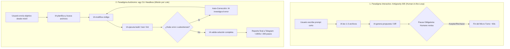

# Guía de Paradigmas y Experiencia de Desarrollo (DX): Antigravity IDE vs. Antigravity CLI (`agy`) Autónomo

> **Documento de Arquitectura y Buenas Prácticas sobre la dinámica de ejecución, tiempos, autonomía y gobernanza de agentes de Inteligencia Artificial en entornos interactivos vs. remotos desatendidos.**

---

## 1. La Gran Pregunta: ¿Por qué en el Bot tarda 1000s y en el IDE unos pocos minutos?

Al utilizar este puente móvil por primera vez, es muy común experimentar una sorpresa considerable respecto a los tiempos y comportamientos:

* **En el Antigravity IDE:** Le pides un cambio al agente, y en **2 a 3 minutos** ves un diff con colores listo para aceptar o rechazar.
* **En el Bot de Telegram (`agy`):** Envías una orden de código desde el celular y la tarea puede extenderse por **500, 1000 o más segundos**, acumulando entre **50 y más de 500 pasos consecutivos**, tocando decenas de archivos e incluso intentando compilar o resolver problemas adyacentes por su cuenta.

### ¿Acaso no comparten el mismo motor?
**Sí, el cerebro es idéntico.** Ambos entornos ejecutan la misma familia de modelos de vanguardia (Google Antigravity con Gemini 3.8 Flash High / Flash Medium / Claude Thinking) y comparten el mismo sistema de herramientas (`read_file`, `replace_file_content`, `run_command`, etc.).

Sin embargo, el **paradigma de ejecución, el ciclo de vida de la sesión y la presencia humana** son completamente opuestos.

---

## 2. Los Dos Paradigmas de Ingeniería con Agentes de IA



### Paradigma A: El Copiloto Interactivo (*Human-in-the-Loop*) — Antigravity IDE
En el IDE visual de escritorio, el modelo está diseñado como un **asistente en pareja (*pair programmer*)**:
1. **Anclaje visual inmediato:** El agente sabe qué archivo tienes abierto, dónde está tu cursor y qué pestañas están activas. Su radio de acción se enfoca espontáneamente en esa área.
2. **Micro-turnos reactivos:** El agente realiza de 1 a 4 llamadas a herramientas, genera un bloque de código y **se detiene de inmediato** para esperar a que el usuario presione *"Accept"*, *"Reject"* o escriba una aclaración.
3. **La ilusión de la rapidez:** Un turno del IDE parece tomar solo 45 segundos, pero una funcionalidad completa en el IDE requiere típicamente que el programador humano interactúe 15 o 20 veces a lo largo de 30 minutos, guiando al modelo paso a paso.

### Paradigma B: El Agente Autónomo de Misión (*Autonomous Batch Agent*) — `agy` CLI en Telegram
En el Bot de Telegram, invocamos `agy` en modo *headless* (sin interfaz gráfica) mediante órdenes por lotes:
1. **Macro-turnos orientados a metas (*Goal-Driven*):** El agente recibe un requerimiento desde el celular (por ejemplo: *"Configurar el módulo de facturación electrónica con certificados .p12 y probar compatibilidad"*). Al no haber un humano sentado frente a la consola presionando botones cada 20 segundos, el agente asume la responsabilidad de **entregar el objetivo 100% resuelto y validado** antes de terminar.
2. **El bucle recursivo de auto-sanación (*Self-Healing Loop*):**
   * El agente lee los archivos necesarios (pasos 1 al 20).
   * Escribe el nuevo código (pasos 21 al 40).
   * Ejecuta un comando de verificación (paso 41).
   * **Encuentra un fallo** (ej. una importación faltante, un tipado TypeScript incorrecto o una dependencia no instalada).
   * En lugar de detenerse y quejarse en Telegram, el agente piensa: *"Mi misión no ha terminado, debo resolver este fallo para que el código funcione"*.
   * Abre los archivos de error, instala dependencias, refactoriza métodos auxiliares y vuelve a probar (pasos 42 al 150).
   * Si vuelve a fallar, ¡vuelve a corregir!
3. **Conclusión:** Lo que en Telegram se ve como una sola tarea de 1000 segundos y 400 pasos es, en realidad, **el equivalente a 20 o 30 micro-turnos del IDE ejecutados de forma totalmente autónoma y continua mientras caminas por la calle o viajas en transporte público.**

---

## 3. El Factor Permisos: ¿Por qué `agy` "hace cosas sin pedir permiso"?

Una de las sorpresas más notables es notar que `agy` ejecuta comandos de consola, crea carpetas o toca archivos que no estaban explícitamente en el prompt.

### La razón técnica: `--dangerously-skip-permissions`
Para que un bot de Telegram funcione desatendido en una laptop en casa mientras estás en movilidad, el puente ejecuta `agy` con la bandera:
`--dangerously-skip-permissions`

* **En el IDE:** Si Antigravity desea ejecutar un script de PowerShell o modificar un archivo del sistema, la interfaz gráfica te bloquea y te pide confirmación mediante un diálogo emergente interactivo.
* **En el CLI Headless:** Si `agy` se detuviera a solicitar confirmación estándar por consola (`[y/N]`), **el subproceso se congelaría eternamente**, ya que en segundo plano (`pythonw.exe`) no existe una consola interactiva visible para ingresar texto por teclado.
* **Efecto colateral:** Al concederle permiso de ejecución sin trabas, el modelo entra en un estado de **proactividad máxima**. Si cree que para verificar un cambio necesita compilar la solución, correr los tests de integración o crear un archivo auxiliar en el disco, **lo hará sin titubear**.

> [!NOTE]
> Esta enorme proactividad no es un defecto; es su mayor superpoder para resolver problemas complejos a la distancia. Sin embargo, requiere entender cómo orientar al modelo para que no gaste tiempo en caminos no deseados.

---

## 4. Matriz Comparativa: Antigravity IDE vs. `agy` Telegram Bridge

| Criterio | Antigravity IDE (Escritorio) | Antigravity CLI (`agy`) vía Telegram Bridge |
| :--- | :--- | :--- |
| **Rol del Sistema** | Copiloto / Asistente interactivo. | Agente Autónomo / Desarrollador Senior en segundo plano. |
| **Tiempo de Ciclo** | 30s – 2 minutos por turno. | 300s – 1200s (según la complejidad del objetivo). |
| **Número de Pasos** | 1 a 5 pasos por interacción. | 50 a más de 500 pasos por misión. |
| **Supervisión Humana** | Continua (en cada diff o comando). | Por hitos (notificaciones de progreso en Telegram). |
| **Contexto Inicial** | Cursor y pestaña activa del editor. | Todo el repositorio + historial de sesiones SQLite (`brain/`). |
| **Tolerancia a Errores** | El usuario corrige al modelo al vuelo. | El modelo se auto-corrige iterativamente hasta lograr el éxito. |
| **Consumo de Hardware** | Alto (~1.5 GB a 3 GB RAM en Electron/VS Code). | Mínimo (~40 MB RAM el puente + `agy` en CLI). |
| **Movilidad** | Nula (atado al escritorio / laptop abierta). | **Total (desde el teléfono en cualquier lugar del mundo).** |

---

## 5. Cómo Calibrar y Conducir a `agy` sin "Castrar" su Potencia

No es necesario limitar ni desactivar las herramientas de `agy`; su capacidad para investigar y auto-corregirse es lo que permite que resuelva bugs reales mientras no estás frente a la computadora. Lo que se necesita es **conducción arquitectónica y reglas claras**:

### 1. Gobernanza por Constitución del Repositorio (`constitution.md`)
El agente de Antigravity lee y respeta rigurosamente las reglas locales del proyecto activo (`.ai/rules/`, `constitution.md`, `AGENTS.md`).

Si hay acciones que **bajo ninguna circunstancia** deba realizar por su cuenta (por ejemplo: conectarse a servicios tributarios del gobierno, ejecutar servidores en localhost o modificar credenciales de producción), establécelo como un **Invariante Inquebrantable** en las reglas de tu repositorio:

```markdown
### INVARIANTE: Zonas Prohibidas y Ejecución Local
1. PROHIBIDO terminantemente ejecutar o intentar levantar servidores en localhost.
2. PROHIBIDO emitir comprobantes o transacciones hacia entidades regulatorias/gubernamentales (ej. SRI) sin orden explícita.
3. Si un comando o prueba requiere un servicio externo no disponible, simular mediante mocks o advertir en el reporte final.
```
Al tener esto en su constitución, `agy` detendrá cualquier impulso de ejecutar pruebas no deseadas, ahorrando cientos de pasos y cientos de segundos.

### 2. Uso Estratégico del Modo Planificación (`/mode plan` o `/plan <tarea>`)
Para tareas de gran envergadura o arquitecturas sensibles donde no quieres que la IA empiece a modificar código de golpe:
1. Envía desde Telegram:
   ```text
   /plan Diseñar la integración del módulo de facturación electrónica con certificados .p12
   ```
2. El puente activa el modo plan estricto: `agy` investiga a fondo, inspecciona archivos, elabora `implementation_plan.md` y **se detiene obligatoriamente**.
3. En tu teléfono recibes el resumen y el botón **`[ 🧠 Ver Plan ]`**.
4. Lo revisas tranquilamente desde el móvil y, solo cuando estés de acuerdo con su enfoque, pulsas **`[ ▶️ Ejecutar Plan ]`**.

### 3. Delimitación de Fronteras en el Prompt Móvil (*Scope-Bounded Prompting*)
Al redactar una orden en Telegram, aprovecha la gran comprensión del modelo para fijar sus límites operacionales:
* 🔴 **Prompt Desbordante:**  
  *"Haz que funcione el módulo de firmas electrónicas."*  
  *(Resultado: `agy` intentará compilar todo el sistema, buscar dependencias, probar puertos locales y tardará más de 1000 segundos).*
* 🟢 **Prompt Conducido y Eficiente:**  
  *"Revisa los archivos del servicio de firmas, corrige el tipado de los certificados según la interfaz `ICertificate` y documenta los cambios. **Solo modifica esos archivos, no intentes compilar ni ejecutar pruebas locales.**"*  
  *(Resultado: `agy` se concentrará de forma quirúrgica, resolviendo la tarea en menos de 2 minutos y con menos de 30 pasos).*

### 4. Intervención Táctica en Vivo: Botón `[ 🛑 Detener Tarea ]` y `/stop`
Si observas en la telemetría en vivo de Telegram que el contador pasa de 150 segundos o 50 pasos y notas que el agente entró en un camino exploratorio innecesario:
* Pulsa de inmediato el botón interactivo **`[ 🛑 Detener / Cancelar Tarea ]`** en el mensaje de progreso, o envía `/stop` / `/cancel`.
* El puente ejecutará `kill_process_tree()` fulminando los procesos en milisegundos en Windows sin dejar archivos bloqueados ni tareas colgadas.

---

## 6. Resumen de Buenas Prácticas para Usuarios de este Repositorio

1. **Entiende el valor de los 1000 segundos:** Cuando `agy` tarda 15 minutos en el bot, no está "congelado"; está haciendo el trabajo pesado que un desarrollador humano haría en media hora de investigación, refactorización y depuración.
2. **Confía en el Idle Watchdog:** El sistema cuenta con un vigilante de inactividad de 600 segundos por paso (`STEP_IDLE_TIMEOUT`). Si el agente sigue cambiando de paso, déjalo trabajar; está resolviendo la misión.
3. **Usa el planificador como filtro:** Usa `/plan` para pensar y diseñar; usa `/mode accept-edits` para construir.
4. **Protege tu proyecto con reglas:** No hardcodees restricciones en el bot de Telegram; colócalas en las reglas de tu propio repositorio (`.ai/rules/constitution.md`) para que apliquen tanto en el bot como en el IDE.

---

*Documento desarrollado como parte de la infraestructura de ingeniería de **Antigravity Telegram Mobile Bridge**.*  
*Copyright (c) 2026 Gerson Javier Castellanos Niño. Licencia MIT.*
