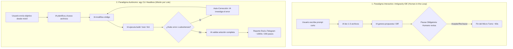
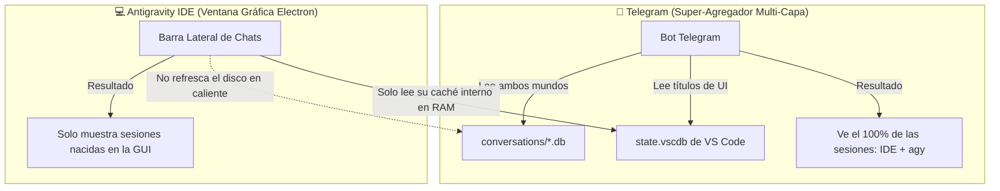

# Guía de Paradigmas y Experiencia de Desarrollo (DX): Antigravity IDE vs. Antigravity CLI (`agy`) Autónomo

> **Documento de Arquitectura y Buenas Prácticas sobre la dinámica de ejecución, tiempos, autonomía y gobernanza de agentes de Inteligencia Artificial en entornos interactivos vs. remotos desatendidos.**

---

## 1. La Gran Pregunta: ¿Por qué en el Bot tarda 1000s y en el IDE unos pocos minutos?

Al utilizar este puente móvil por primera vez, es muy común experimentar una sorpresa considerable respecto a los tiempos y comportamientos:

* **En el Antigravity IDE:** Le pides un cambio al agente, y en **2 a 3 minutos** ves un diff con colores listo para aceptar o rechazar.
* **En el Bot de Telegram (`agy`):** Envías una orden de código desde el celular y la tarea puede extenderse por **500, 1000 o más segundos**, acumulando entre **50 y más de 500 pasos consecutivos**, tocando decenas de archivos e incluso intentando compilar o resolver problemas adyacentes por su cuenta.

### ¿Acaso no comparten el mismo motor?
**Sí, el cerebro es idéntico.** Ambos entornos ejecutan la misma familia de modelos de vanguardia (Google Antigravity con Gemini 3.8 Flash High / Flash Medium / Claude Thinking) y comparten el mismo sistema de herramientas (`read_file`, `replace_file_content`, `run_command`, etc.).

Sin embargo, el **paradigma de ejecución, el ciclo de vida de la sesión y la presencia humana** son completamente opuestos.

---

## 2. Los Dos Paradigmas de Ingeniería con Agentes de IA



### Paradigma A: El Copiloto Interactivo (*Human-in-the-Loop*) — Antigravity IDE
En el IDE visual de escritorio, el modelo está diseñado como un **asistente en pareja (*pair programmer*)**:
1. **Anclaje visual inmediato:** El agente sabe qué archivo tienes abierto, dónde está tu cursor y qué pestañas están activas. Su radio de acción se enfoca espontáneamente en esa área.
2. **Micro-turnos reactivos:** El agente realiza de 1 a 4 llamadas a herramientas, genera un bloque de código y **se detiene de inmediato** para esperar a que el usuario presione *"Accept"*, *"Reject"* o escriba una aclaración.
3. **La ilusión de la rapidez:** Un turno del IDE parece tomar solo 45 segundos, pero una funcionalidad completa en el IDE requiere típicamente que el programador humano interactúe 15 o 20 veces a lo largo de 30 minutos, guiando al modelo paso a paso.

### Paradigma B: El Agente Autónomo de Misión (*Autonomous Batch Agent*) — `agy` CLI en Telegram
En el Bot de Telegram, invocamos `agy` en modo *headless* (sin interfaz gráfica) mediante órdenes por lotes:
1. **Macro-turnos orientados a metas (*Goal-Driven*):** El agente recibe un requerimiento desde el celular (por ejemplo: *"Configurar el módulo de facturación electrónica con certificados .p12 y probar compatibilidad"*). Al no haber un humano sentado frente a la consola presionando botones cada 20 segundos, el agente asume la responsabilidad de **entregar el objetivo 100% resuelto y validado** antes de terminar.
2. **El bucle recursivo de auto-sanación (*Self-Healing Loop*):**
   * El agente lee los archivos necesarios (pasos 1 al 20).
   * Escribe el nuevo código (pasos 21 al 40).
   * Ejecuta un comando de verificación (paso 41).
   * **Encuentra un fallo** (ej. una importación faltante, un tipado TypeScript incorrecto o una dependencia no instalada).
   * En lugar de detenerse y quejarse en Telegram, el agente piensa: *"Mi misión no ha terminado, debo resolver este fallo para que el código funcione"*.
   * Abre los archivos de error, instala dependencias, refactoriza métodos auxiliares y vuelve a probar (pasos 42 al 150).
   * Si vuelve a fallar, ¡vuelve a corregir!
3. **Conclusión:** Lo que en Telegram se ve como una sola tarea de 1000 segundos y 400 pasos es, en realidad, **el equivalente a 20 o 30 micro-turnos del IDE ejecutados de forma totalmente autónoma y continua mientras caminas por la calle o viajas en transporte público.**

---

## 3. El Factor Permisos: ¿Por qué `agy` "hace cosas sin pedir permiso"?

Una de las sorpresas más notables es notar que `agy` ejecuta comandos de consola, crea carpetas o toca archivos que no estaban explícitamente en el prompt.

### La razón técnica: `--dangerously-skip-permissions`
Para que un bot de Telegram funcione desatendido en una laptop en casa mientras estás en movilidad, el puente ejecuta `agy` con la bandera:
`--dangerously-skip-permissions`

* **En el IDE:** Si Antigravity desea ejecutar un script de PowerShell o modificar un archivo del sistema, la interfaz gráfica te bloquea y te pide confirmación mediante un diálogo emergente interactivo.
* **En el CLI Headless:** Si `agy` se detuviera a solicitar confirmación estándar por consola (`[y/N]`), **el subproceso se congelaría eternamente**, ya que en segundo plano (`pythonw.exe`) no existe una consola interactiva visible para ingresar texto por teclado.
* **Efecto colateral:** Al concederle permiso de ejecución sin trabas, el modelo entra en un estado de **proactividad máxima**. Si cree que para verificar un cambio necesita compilar la solución, correr los tests de integración o crear un archivo auxiliar en el disco, **lo hará sin titubear**.

> [!NOTE]
> Esta enorme proactividad no es un defecto; es su mayor superpoder para resolver problemas complejos a la distancia. Sin embargo, requiere entender cómo orientar al modelo para que no gaste tiempo en caminos no deseados.

---

## 4. Matriz Comparativa: Antigravity IDE vs. `agy` Telegram Bridge

| Criterio | Antigravity IDE (Escritorio) | Antigravity CLI (`agy`) vía Telegram Bridge |
| :--- | :--- | :--- |
| **Rol del Sistema** | Copiloto / Asistente interactivo. | Agente Autónomo / Desarrollador Senior en segundo plano. |
| **Tiempo de Ciclo** | 30s – 2 minutos por turno. | 300s – 1200s (según la complejidad del objetivo). |
| **Número de Pasos** | 1 a 5 pasos por interacción. | 50 a más de 500 pasos por misión. |
| **Supervisión Humana** | Continua (en cada diff o comando). | Por hitos (notificaciones de progreso en Telegram). |
| **Contexto Inicial** | Cursor y pestaña activa del editor. | Todo el repositorio + historial de sesiones SQLite (`brain/`). |
| **Tolerancia a Errores** | El usuario corrige al modelo al vuelo. | El modelo se auto-corrige iterativamente hasta lograr el éxito. |
| **Consumo de Hardware** | Alto (~1.5 GB a 3 GB RAM en Electron/VS Code). | Mínimo (~40 MB RAM el puente + `agy` en CLI). |
| **Movilidad** | Nula (atado al escritorio / laptop abierta). | **Total (desde el teléfono en cualquier lugar del mundo).** |

---

## 5. Cómo Calibrar y Conducir a `agy` sin "Castrar" su Potencia

No es necesario limitar ni desactivar las herramientas de `agy`; su capacidad para investigar y auto-corregirse es lo que permite que resuelva bugs reales mientras no estás frente a la computadora. Lo que se necesita es **conducción arquitectónica y reglas claras**:

### 1. Gobernanza por Constitución del Repositorio (`constitution.md`)
El agente de Antigravity lee y respeta rigurosamente las reglas locales del proyecto activo (`.ai/rules/`, `constitution.md`, `AGENTS.md`).

Si hay acciones que **bajo ninguna circunstancia** deba realizar por su cuenta (por ejemplo: conectarse a servicios tributarios del gobierno, ejecutar servidores en localhost o modificar credenciales de producción), establécelo como un **Invariante Inquebrantable** en las reglas de tu repositorio:

```markdown
### INVARIANTE: Zonas Prohibidas y Ejecución Local
1. PROHIBIDO terminantemente ejecutar o intentar levantar servidores en localhost.
2. PROHIBIDO emitir comprobantes o transacciones hacia entidades regulatorias/gubernamentales (ej. SRI) sin orden explícita.
3. Si un comando o prueba requiere un servicio externo no disponible, simular mediante mocks o advertir en el reporte final.
```
Al tener esto en su constitución, `agy` detendrá cualquier impulso de ejecutar pruebas no deseadas, ahorrando cientos de pasos y cientos de segundos.

### 2. El Modo Directo como Estándar Dorado vs. El Antipatrón del Modo Plan Persistente
Uno de los descubrimientos arquitectónicos y operativos más relevantes de este puente es la relación entre el **Modo de Ejecución** y la naturaleza del agente:

* **En el IDE visual:** El "modo plan" es cómodo porque tú estás mirando la pantalla y apruebas cada paso interactivamente.
* **En el CLI autónomo (`agy`):** El **modo plan persistente es un antipatrón**. ¿Por qué?
  1. **Castración del Bucle ReAct:** La mayor fortaleza de `agy` es su capacidad autónoma de razonar, editar código, ejecutar la consola, leer el error del compilador y auto-reparar el código en una sola misión ininterrumpida. Si activas `plan` permanentemente, le atas las manos: el agente recibe instrucciones del sistema que le prohíben modificar archivos.
  2. **Dilema Cognitivo en Aprobación:** Cuando el usuario revisa el plan en Telegram y responde *"Aprobado, comencemos"*, si el bot sigue en modo plan, `agy` sufre un conflicto insalvable: el usuario le pide ejecutar, pero el sistema le prohíbe editar archivos.
  3. **Evidencia Empírica de Laboratorio:**
     - **Sesión `a265cdd3` (Bloqueada por Modo Plan Persistente):** El usuario aprobó el plan diciendo *"Comencemos"*, pero la persistencia del modo plan impidió a `agy` escribir código, devolviendo respuestas descriptivas sin tocar el repositorio y sin ejecutar commit alguno.
     - **Sesión `343c1443` (Éxito Autónomo en Modo Directo):** Con el bot en **Modo Directo (`accept-edits`)** y un prompt acotado, `agy` ejecutó autónomamente la misión: compiló módulos de reportes y gestión en un monorepo complejo, detectó y reparó errores de tipado estricto en Angular 19/20 (`NG8113`/`NG8107`), corrigió `results-page.component.ts`, verificó `landing-page` y redactó el informe final `walkthrough.md` en un solo ciclo fluido y perfecto.

#### La Solución de Ingeniería Implementada:
1. **Modo Predeterminado Oficial:** El puente opera siempre por defecto en **`⚡ Directo (accept-edits)`**.
2. **Planificación Quirúrgica Bajo Demanda:** Para diseñar arquitectura previa sin tocar código, usa el atajo `/plan <tarea>`. `agy` diseña el plan, genera `implementation_plan.md` y se detiene obligatoriamente.
3. **Smart Plan Approval y Desbloqueo Automático:** Cuando estés listo para construir, pulsa **`[ ▶️ Ejecutar Plan ]`**, envía `/approve` o simplemente escribe en lenguaje natural *"Aprobado, comencemos"*. El motor de Smart Approval detecta tu intención, conmuta automáticamente a modo directo (`accept-edits`), persiste el cambio y arranca la ejecución del código sin trabas.

### 3. Delimitación de Fronteras en el Prompt Móvil (*Scope-Bounded Prompting*)
Al redactar una orden en Telegram, aprovecha la gran comprensión del modelo para fijar sus límites operacionales mediante directivas negativas explícitas:
* 🔴 **Prompt Desbordante:**  
  *"Haz que funcione el módulo de firmas electrónicas."*  
  *(Resultado: `agy` intentará compilar todo el sistema, buscar dependencias, probar puertos locales y tardará más de 1000 segundos).*
* 🟢 **Prompt Conducido y Eficiente:**  
  *"Revisa los archivos del servicio de firmas, corrige el tipado de los certificados según la interfaz `ICertificate` y documenta los cambios. **Solo modifica esos archivos, no intentes compilar ni ejecutar pruebas locales.**"*  
  *(Resultado: `agy` se concentrará de forma quirúrgica, resolviendo la tarea en menos de 2 minutos y con menos de 30 pasos).*

> 📘 **Guía Especializada:** Hemos dedicado un manual completo con la anatomía de los 4 pilares, casos de uso reales y el *cheat-sheet* de directivas negativas:  
> 👉 [Guía Maestra de Prompting Acotado para Agentes Autónomos (`agy`)](Guia_Prompts_Acotados_Agentes_Autonomos.md)

### 4. Intervención Táctica en Vivo: Botón `[ 🛑 Detener Tarea ]` y `/stop`
Si observas en la telemetría en vivo de Telegram que el contador pasa de 150 segundos o 50 pasos y notas que el agente entró en un camino exploratorio innecesario:
* Pulsa de inmediato el botón interactivo **`[ 🛑 Detener / Cancelar Tarea ]`** en el mensaje de progreso, o envía `/stop` / `/cancel`.
* El puente ejecutará `kill_process_tree()` fulminando los procesos en milisegundos en Windows sin dejar archivos bloqueados ni tareas colgadas.

---

## 6. La Realidad de las Sesiones: ¿Por qué Telegram ve todo pero el IDE solo ve sus chats locales?

Una de las dudas más frecuentes de los desarrolladores es:  
> *"¿Por qué desde Telegram puedo ver y continuar los chats que inicié en el IDE, pero en la barra lateral del IDE no aparecen los chats que creé desde Telegram?"*

### La Explicación Técnica: Caché en RAM vs. Almacenamiento en Disco



1. **La Base de Datos Privada de la GUI (`state.vscdb`):**  
   El Antigravity IDE es una aplicación de escritorio basada en VS Code (Electron). La lista de chats que ves en su barra lateral izquierda no se lee directamente del disco en cada segundo; se carga al iniciar en la memoria RAM del proceso gráfico a partir de una base de datos interna (`state.vscdb`), codificada en un buffer binario comprimido con Protocol Buffers.
2. **`agy` escribe en disco, no en la RAM del IDE:**  
   Cuando `agy` corre desatendido en segundo plano convocado por Telegram, escribe sus historiales (`conversations/*.db`) y su cerebro (`transcript.jsonl`) directamente en el disco duro. La ventana abierta de VS Code no se entera de estos archivos nuevos porque no tiene un vigilante de recarga en caliente para su barra lateral.
3. **La sesión del IDE exige "Contexto Visual":**  
   Una sesión gráfica de IDE guarda la pestaña activa, la línea y columna exacta del cursor y los bloques de diff interactivos dibujados en el editor. Una sesión creada en Telegram es pura consola headless: no posee coordenadas de cursor ni pestañas visuales de VS Code asociadas.
4. **Por qué Telegram sí ve ambos mundos:**  
   El bot actúa como un **super-agregador universal**: tiene un motor de resolución en 4 capas que inspecciona `conversation_summaries.db`, las bases de datos de `conversations/`, el `transcript.jsonl` y `state.vscdb`. Cruza ambas fuentes y te presenta la lista completa y unificada.

> [!TIP]
> **El Truco Pro de Continuidad Bidireccional:**  
> Si quieres que una conversación exista en ambos lados (en la barra lateral de tu laptop y en tu celular):  
> 1. Abre el IDE en tu casa y envía el primer mensaje corto para inaugurar el hilo (*ej. "Iniciando módulo de reportes"*).  
> 2. Cierra la laptop y sal a la calle.  
> 3. Abre Telegram, ejecuta `/sessions`, toca esa sesión y continúa programando. ¡Todo el trabajo quedará registrado en el hilo oficial del IDE y reflejado en el código!

---

## 7. Los 6 Superpoderes Exclusivos del Bot Móvil frente al IDE

Aunque el IDE visual es insustituible para programar sentado frente a la pantalla con diffs interactivos, el Bot de Telegram ofrece **ventajas arquitectónicas y operativas que el IDE simplemente no puede igualar**:

### 1. Desacoplamiento de la Ansiedad de Desarrollo (*Async Mindset*)
* **En el IDE:** Te sientas a mirar el cursor parpadeante de la IA. Si la tarea tarda 2 minutos, te impacientes, abres redes sociales o pierdes el foco (*context switching*).
* **En Telegram:** La programación se vuelve **completamente asíncrona**. Envías la orden, guardas el teléfono en el bolsillo y sigues con tu vida (caminando, comprando un café o viajando). Cuando el teléfono vibra con la notificación `✅ Tarea Concluida`, abres el resumen y revisas el diff.

### 2. Ahorro Masivo de Batería y Refrigeración de la Laptop
* **En el IDE:** Pantalla encendida al 100%, renderizado acelerado por GPU de Electron, ventiladores al máximo. Una laptop con batería se agota en 1.5 a 2 horas.
* **En el Bot:** La laptop opera con **la tapa cerrada y la pantalla apagada**. El consumo energético cae en más de un 60%, los ventiladores apenas giran y un equipo modesto (incluso con 8 GB de RAM) puede procesar compilaciones pesadas durante horas sin sobrecalentarse.

### 3. Multimodalidad Móvil Inmediata (Cero Fricción con Fotos)
* **En el IDE:** Para mostrarle a la IA un bug visual que viste en tu teléfono, tienes que tomar la captura, enviártela por correo o WhatsApp Web, descargarla a la carpeta del proyecto y arrastrarla a VS Code.
* **En Telegram:** Ves el bug en tu teléfono $\rightarrow$ tomas la captura de pantalla $\rightarrow$ la compartes directamente al bot con el texto *"Arregla la alineación de este botón"* $\rightarrow$ `agy` descarga la imagen, la procesa con la visión de Gemini y modifica el CSS en tu laptop. ¡Fricción cero!

### 4. Conmutación Multi-Proyecto Ultraliviana (Sin Consumo de RAM)
* **En el IDE:** Si tienes 5 proyectos de clientes, abrir 5 ventanas de VS Code consume entre **6 y 12 GB de memoria RAM**, saturando cualquier equipo de 8 GB o 16 GB.
* **En Telegram:** Usas `/projects` y cambias de repositorio en **0.1 segundos** sin abrir ventanas de escritorio, consumiendo únicamente los mismos ~40 MB de RAM del servicio en segundo plano.

### 5. Flujo DevOps Completo en el Bolsillo (Plan $\rightarrow$ Diff $\rightarrow$ Push $\rightarrow$ Deploy)
Desde el celular tienes el control de todo el ciclo de entrega de software:
1. `/plan <tarea>` $\rightarrow$ Diseña la arquitectura.
2. `[ ▶️ Ejecutar Plan ]` $\rightarrow$ Construye y repara el código.
3. `[ 🔍 Ver Diff ]` $\rightarrow$ Inspeccionas las líneas exactas tocadas.
4. `[ ✅ Commit ]` $\rightarrow$ La IA redacta el mensaje convencional y hace push a GitHub.
5. `[ 👁️ Vigilar Fin de Deploy ]` $\rightarrow$ El bot vigila GitHub Actions y te avisa cuando tu web en producción esté 100% desplegada.

### 6. Guardián Físico del Equipo y la Oficina
El bot incluye telemetría Win32 (`/battery` y Watchdog de Energía). Si hay un corte de luz en tu casa o alguien tropieza con el cable del cargador de la laptop mientras estás fuera, el bot te envía una alerta de emergencia a Telegram al instante con el porcentaje y autonomía restante.

---

## 8. Resumen de Buenas Prácticas para Usuarios de este Repositorio

1. **Entiende el valor de los 1000 segundos:** Cuando `agy` tarda 15 minutos en el bot, no está "congelado"; está haciendo el trabajo pesado que un desarrollador humano haría en media hora de investigación, refactorización y depuración autónoma.
2. **Confía en el Idle Watchdog:** El sistema cuenta con un vigilante de inactividad de 600 segundos por paso (`STEP_IDLE_TIMEOUT`). Si el agente sigue cambiando de paso, déjalo trabajar; está resolviendo la misión.
3. **El Modo Directo es el estándar:** Mantén el bot en `⚡ Directo (accept-edits)` para que `agy` complete su bucle ReAct de auto-reparación. Usa `/plan` exclusivamente cuando desees un documento previo de diseño.
4. **Acota tus requerimientos:** Aplica los principios de la [Guía de Prompting Acotado](Guia_Prompts_Acotados_Agentes_Autonomos.md) para concentrar la potencia de `agy` en segundos.
5. **Protege tu proyecto con reglas:** No hardcodees restricciones en el bot de Telegram; colócalas en las reglas de tu propio repositorio (`.ai/rules/constitution.md`) para que apliquen tanto en el bot como en el IDE.

> 📚 **Otras lecturas recomendadas:**  
> - 📖 [Manual Exhaustivo de Comandos, Botones y Flujos Operativos](Manual_Completo_Comandos_Botones_y_Flujos.md)  
> - 🎯 [Guía Maestra de Prompting Acotado para Agentes Autónomos (`agy`)](Guia_Prompts_Acotados_Agentes_Autonomos.md)  
> - 🛡️ [Guía de Gobernanza, Reglas de Proyecto y Blindaje de Código (`constitution.md`)](Guia_Gobernanza_Reglas_y_Blindaje.md)  
> - 🔧 [Guía de Resolución de Problemas, Diagnóstico y Rescate Operativo](Guia_Resolucion_Problemas_y_Diagnostico.md)  

---

*Documento desarrollado como parte de la infraestructura de ingeniería de **Antigravity Telegram Mobile Bridge**.*  
*Copyright (c) 2026 Gerson Javier Castellanos Niño. Licencia MIT.*

