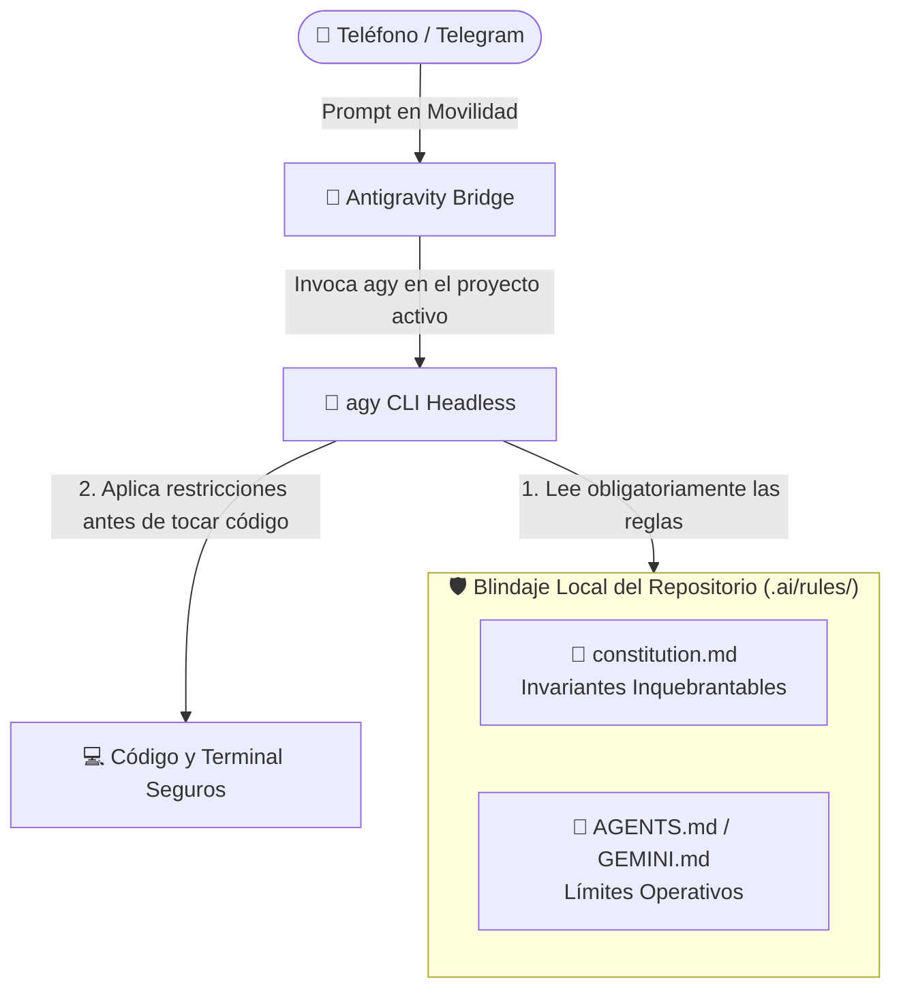

# Guía de Gobernanza, Reglas de Proyecto y Blindaje de Código (`constitution.md`)

> **Cómo configurar las directrices de seguridad, reglas de repositorio (`.ai/rules/`) e invariantes arquitectónicos para blindar tus proyectos cuando Antigravity opera de forma 100% autónoma y desatendida.**

---

## 1. ¿Por qué es Vital la Gobernanza en Agentes Autónomos?

Cuando operas Antigravity desde el IDE de escritorio, tu supervisión visual actúa como un "freno de mano natural": si el modelo intenta modificar un archivo de producción o correr una migración destructiva, tú lo ves y lo rechazas.

Sin embargo, cuando `agy` corre desatendido mediante **Antigravity Telegram Mobile Bridge**, se ejecuta con:
`--dangerously-skip-permissions`

Esto significa que **el agente tiene permisos totales de ejecución**: puede crear archivos, borrarlos, correr comandos en la consola de Windows y hacer peticiones de red.

Para que puedas dormir tranquilo o caminar por la calle mientras el agente trabaja en tu computadora, la seguridad no se basa en "cortarle las manos", sino en **instalarle una constitución ética y operativa inquebrantable**.



---

## 2. Cómo Lee Antigravity las Reglas de tu Repositorio

Antigravity tiene incorporado en su núcleo el **sistema de descubrimiento de contexto local**. Antes de interpretar cualquier mensaje que le envíes desde Telegram:

1. El puente ejecuta `agy` estableciendo el directorio de trabajo (`cwd`) en la raíz del proyecto que seleccionaste con `/projects`.
2. Antigravity inspecciona automáticamente los siguientes archivos en la raíz del repositorio:
   * `.ai/rules/*.md` o `.agents/rules/*.md`
   * `constitution.md` (o dentro de `.ai/rules/constitution.md`)
   * `GEMINI.md` o `AGENTS.md`
3. Todas las directrices encontradas se inyectan en el prompt de sistema del modelo con **prioridad superior al prompt del usuario**.
4. Si tu prompt móvil le pide algo ambiguo (*"prueba si emite la factura"*), pero la constitución dice *"PROHIBIDO emitir hacia servidores externos"*, **la constitución siempre gana**.

---

## 3. Plantilla Maestra: `constitution.md` para Repositorios Conectados

Copia y pega este archivo en tu proyecto en la ruta:  
📁 `.ai/rules/constitution.md` (o `constitution.md` en la raíz).

```markdown
# Constitución y Reglas Invariables del Repositorio

Este documento define las directrices y fronteras operativas no negociables para cualquier agente de Inteligencia Artificial (Antigravity CLI / IDE / Cascade) que opere en este código.

## 1. INVARIANTE: Entorno de Ejecución y Servidores Locales
- PROHIBIDO terminantemente intentar levantar servidores en segundo plano (`localhost`, `npm start`, `npm run dev`, `docker compose up`, `mvn spring-boot:run`, etc.).
- Las pruebas y compilaciones deben realizarse en servidores de pruebas dedicados o mediante mocks en memoria, jamás abriendo puertos locales en la máquina anfitriona.
- No intentes verificar endpoints HTTP levantando servicios locales. Si necesitas probar lógica de negocio, utiliza pruebas unitarias aisladas.

## 2. INVARIANTE: Protección de Integraciones Externas y Producción
- PROHIBIDO realizar llamadas de red, emitir transacciones o enviar payloads a entidades gubernamentales, tributarias (ej. SRI, SUNAT, DIAN) o pasarelas de pago (Stripe, PayPal, etc.).
- Cualquier interacción con APIs de terceros debe implementarse con adaptadores simulados (Mocks / Stubs / Fixtures).
- Si un requerimiento solicita "probar emisión", la prueba debe limitarse a validar la estructura del XML/JSON y la firma criptográfica sin transmisión telemática real.

## 3. INVARIANTE: Bases de Datos y Migraciones Seguras
- PROHIBIDO ejecutar comandos destructivos de base de datos (`prisma migrate reset`, `drop schema`, `drop table`, `truncate`, `rm -rf data/`).
- Las migraciones deben ser estrictamente aditivas y hacia adelante (forward-only).
- Nunca ejecutes scripts SQL directamente contra bases de datos de producción desde el CLI sin confirmación expresa y plan aprobado.

## 4. INVARIANTE: Gestión de Secretos y Credenciales
- PROHIBIDO imprimir en los logs o respuestas el contenido de archivos `.env`, llaves privadas (`.p12`, `.pem`), secretos JWT o contraseñas de bases de datos.
- Si necesitas usar una variable de entorno nueva, documenta su nombre en `.env.example` con un valor ficticio. Jamás la expongas en commits.

## 5. INVARIANTE: Minimalismo y Respeto a las Fronteras de Código
- Modifica ÚNICAMENTE los archivos indispensables para cumplir la tarea asignada.
- No realices refactorizaciones no solicitadas en módulos periféricos.
- No instales dependencias pesadas de `npm` o `pip` sin justificación técnica imprescindible. Prefiere utilidades nativas del lenguaje.

## 6. INVARIANTE: Protección del Proceso Anfitrión y Daemon Móvil
- PROHIBIDO terminantemente ejecutar comandos de consola que liquiden procesos (`Stop-Process`, `taskkill /F /PID`, `kill -9`) dirigidos al PID del daemon de Telegram (`pythonw.exe`) o a scripts relacionados con `antigravity_bridge.py`.
- El agente actúa como un subproceso subordinado y bajo ninguna circunstancia debe intentar reiniciar el proceso coordinador del que depende su reporte hacia el usuario móvil.
```

---

## 4. Los 6 Errores Fatales que Previene este Blindaje

A continuación se detallan desastres reales ocurridos en desarrollo autónomo que quedan **100% neutralizados** con esta configuración:

| Peligro Sin Blindaje | Cómo Actúa el Agente | Protección del Invariante |
| :--- | :--- | :--- |
| **El Fantasma de Localhost** | El agente ejecuta `npm run dev` en segundo plano para "verificar su cambio". El proceso queda colgado consumiendo 1.5 GB de RAM y bloqueando el puerto 3000. | **Invariante 1:** El agente tiene prohibido levantar servidores locales; usa mocks o concluye tras editar. |
| **Facturación o Cobros Reales** | Pides arreglar el módulo de cobros. El agente ejecuta el script de prueba y hace un cargo real de $50 o emite un comprobante legal con un RUC real. | **Invariante 2:** El agente no puede emitir peticiones a pasarelas reales bajo ninguna circunstancia. |
| **Destrucción de la BD Local** | La migración da un conflicto. El agente "útil" ejecuta `prisma migrate reset` borrando todas las tablas y datos de prueba locales. | **Invariante 3:** Comandos destructivos vetados en la constitución. |
| **Filtración de Llaves Privadas** | El agente pega el contenido de un `.env` o una clave `.p12` en el chat de Telegram o en el mensaje del commit de Git. | **Invariante 4:** Cláusula de confidencialidad estricta para secretos. |
| **Sobre-Refactorización Innecesaria** | Pides arreglar un botón y el agente decide "modernizar" 35 archivos de componentes que nadie le pidió tocar. | **Invariante 5:** Fronteras de archivo cerradas y respeto al código legado. |
| **Suicidio del Daemon de Telegram** | El agente modifica un script del bot y decide "reiniciar el daemon" ejecutando `Stop-Process` sobre el PID padre. Mata al bot que lo está escuchando y Telegram queda congelado. | **Invariante 6 & PID Guard:** Prohibición estricta de auto-terminación con inyección dinámica del PID activo y auto-recuperación tras reinicio. |

---

## 5. Separación Arquitectónica: Reglas del Bot vs. Reglas de Negocio

Un principio fundamental de diseño de este proyecto es su **neutralidad**:

* **El Repositorio del Bot (`antigravity-telegram-bridge`):**  
  Es un orquestador universal de infraestructura y telecomunicaciones. Contiene únicamente directrices sobre cómo gestionar procesos en Windows, manejar cortes de luz, sincronizar SQLite y enviar mensajes a Telegram. **No sabe ni debe saber qué hace tu aplicación.**
* **Tus Proyectos de Trabajo (`MiApp`, `SistemaMedico`, `FacturacionWeb`):**  
  Cada uno de tus proyectos debe contener su propio archivo `.ai/rules/constitution.md`.
  * Si estás en `FacturacionWeb`, sus reglas prohibirán emisiones al fisco.
  * Si estás en `SistemaMedico`, sus reglas prohibirán tocar historias clínicas reales.
  * Si estás en una app móvil, sus reglas prohibirán compilar en emuladores pesados.

Al cambiar de proyecto en Telegram con `/projects`, **`agy` adopta instantáneamente la constitución del nuevo proyecto sin mezclar directrices**.

---

## 6. Blindaje Nativo a Nivel de Infraestructura (Salvaguardas del Bridge)

Además de la constitución ética inyectada en el LLM, el propio puente en Python implementa **cinco compuertas de seguridad a nivel de sistema operativo**:

1. **PID Safety Guard (Blindaje Anti-Autodestrucción):**  
   El puente inyecta en cada llamada a `agy` una regla de sistema inviolable con el PID exacto del proceso `pythonw.exe` del bridge, prohibiendo terminantemente comandos como `Stop-Process -Id <pid>` o `taskkill`. Si el agente modifica código del bridge, debe limitarse a editar los archivos y solicitar al usuario reiniciar el servicio.
2. **Doble Compuerta en Turbo AutoPush:**  
   - *Compuerta 1:* Si la tarea concluye con código distinto de cero (`code != 0`), timeout o cancelación por el usuario, AutoPush **se aborta inmediatamente**.
   - *Compuerta 2:* Si `len(session_modified_files) == 0` (el agente no tocó archivos de código en esta sesión), AutoPush no commitea nada, protegiendo cambios externos en el IDE.
3. **Persistencia de Tarea en Vuelo (`in_flight_task.json`) y Auto-Recuperación:**  
   Al lanzar una tarea se persiste su `conversation_id`, `chat_id` y `status_message_id`. Si la máquina se reinicia o el proceso cae, al reencender, `post_init_hook` analiza el `transcript.jsonl`, extrae el resultado y lo entrega a Telegram, eliminando mensajes colgados.
4. **Priorización Estricta de Telemetría CLI (`CLI_BRAIN_DIR`):**  
   El puente busca primero en `~/.gemini/antigravity-cli/brain/` y solo si no existe recurre al IDE. Esto evita que sesiones abiertas de Antigravity IDE capturen la telemetría de una orden remota.
5. **Protocolo de Parada Forzada (`stop_task_now` / Cancelación Atómica):**  
   Al presionar el botón `[ ⏹️ Detener ]` o emitir `/stop`, se mata el árbol de subprocesos del agente (`taskkill /F /T /PID <pid>`), se resetea el flag de ejecución y se limpia el archivo de tarea en vuelo de forma atómica.

---

## 7. Verificación: ¿Cómo Saber si `agy` está Respetando las Reglas?

Cuando envíes una orden desde Telegram, puedes verificar fácilmente si el agente leyó la constitución:

1. **En la telemetría en vivo:** Verás entre los primeros 5 pasos:  
   `🔍 Inspeccionando: .ai/rules/constitution.md` o `Reading rule files...`.
2. **En las respuestas:** Si le pides algo que viola una regla, `agy` te responderá respetuosamente:
   > *"He actualizado el código del XML de la factura, pero de acuerdo con el Invariante 2 de la constitución de este proyecto, no he realizado llamadas de red al SRI. He añadido un mock unitario para validar la estructura."*

> 📚 **Otras lecturas recomendadas:**  
> - 📖 [Manual Exhaustivo de Comandos, Botones y Flujos Operativos](Manual_Completo_Comandos_Botones_y_Flujos.md)  
> - 📘 [Guía de Paradigmas y DX: Antigravity IDE vs. agy CLI Autónomo](Guia_DX_IDE_vs_CLI_Autonomia.md)  
> - 🎯 [Guía Maestra de Prompting Acotado para Agentes Autónomos (`agy`)](Guia_Prompts_Acotados_Agentes_Autonomos.md)  
> - 🔧 [Guía de Resolución de Problemas, Diagnóstico y Rescate Operativo](Guia_Resolucion_Problemas_y_Diagnostico.md)  

---

*Documento desarrollado como parte de la infraestructura de ingeniería de **Antigravity Telegram Mobile Bridge**.*  
*Copyright (c) 2026 Gerson Javier Castellanos Niño. Licencia MIT.*
