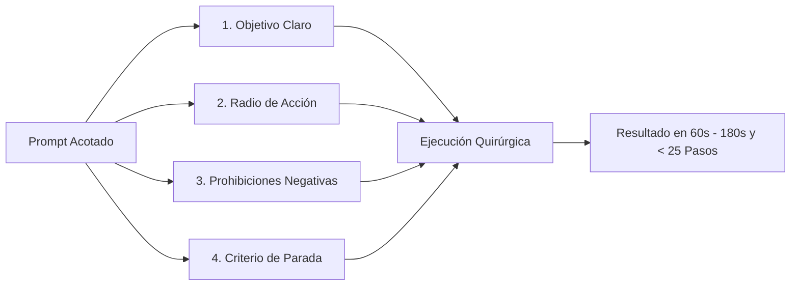

# Guía Maestra de Prompting Acotado para Agentes Autónomos (`agy`)

> **Estrategias de ingeniería de prompts, delimitación de fronteras operativas (*Scope-Bounded Prompting*) y directivas de control para maximizar la precisión y velocidad de Antigravity en movilidad.**

---

## 1. ¿Qué es un Prompt Acotado (*Scope-Bounded Prompt*)?

Un **Prompt Acotado** es una instrucción técnica estructurada que no solo le dice a la Inteligencia Artificial **qué hacer**, sino que define con precisión quirúrgica **dónde operar, qué NO tocar y cuándo detenerse**.

### La diferencia crítica entre un Asistente Visual y un Agente Autónomo
* **En el IDE (Visual):** Si le dices al chat *"Corrige el bug del login"*, tú estás mirando la pantalla. Si el modelo empieza a tocar un archivo que no corresponde, lo detienes al instante con un clic.
* **En `agy` CLI Headless (Telegram):** El agente corre con `--dangerously-skip-permissions` y tiene acceso total a la terminal (`pwsh`), a la edición de archivos y a la red. Si le dices *"Corrige el bug del login"*, el agente entra en un abismo de resolución (*rabbit hole*):
  1. Busca archivos de login en todo el repositorio.
  2. Supone que el backend local no está corriendo e intenta iniciarlo con `docker compose up` o `npm run dev`.
  3. Al ver que faltan variables de entorno, intenta crearlas o modificarlas.
  4. Intenta correr la suite completa de pruebas unitarias (`npm test`).
  5. Si un test antiguo que no tenía nada que ver con el login falla, ¡el agente intentará arreglar también ese test!
  6. **Resultado:** 1200 segundos de ejecución, 400 pasos, archivos innecesarios modificados y un usuario frustrado en el celular.

> [!IMPORTANT]
> Un agente autónomo sin fronteras interpreta el silencio humano como **autorización total para resolver el mundo**. Delimitar el prompt no es "limitar su inteligencia"; es **enfocar su potencia de cálculo láser en el punto exacto que tú necesitas**.

---

## 2. La Anatomía del Prompt Acotado: La Regla de los 4 Pilares

Cualquier orden enviada desde el móvil hacia `agy` debe estructurarse mentalmente en cuatro bloques:

```
┌────────────────────────────────────────────────────────┐
│  1. OBJETIVO CONCRETO (Qué resultado exacto buscas)    │
│  2. RADIO DE ACCIÓN (Archivos o capas permitidas)      │
│  3. RESTRICCIONES NEGATIVAS (Qué está prohibido hacer) │
│  4. CRITERIO DE PARADA (Cómo sabe la IA que terminó)   │
└────────────────────────────────────────────────────────┘
```



### 1. Objetivo Concreto (*The Goal*)
Declara la acción técnica exacta (refactorizar, tipar, corregir excepción, crear endpoint). Evita adjetivos vagos como *"haz que funcione"*, *"mejora el código"* o *"revísalo a ver qué tal"*.

### 2. Radio de Acción (*The Boundary*)
Especifica los archivos, carpetas o capas a las que tiene derecho a entrar.
* *Ejemplo:* `"Limítate exclusivamente a src/services/billing/ y sus interfaces."`

### 3. Restricciones Negativas (*Negative Directives*)
Los LLMs son altamente obedientes a las directivas en mayúscula o con la palabra **"NO"**. Declarar explícitamente lo que no debe intentar ahorra el 80% del tiempo de ejecución.
* *Ejemplo:* `"NO levantes servidores en localhost. NO ejecutes suites de tests completas. NO modifiques el package.json ni archivos de configuración."`

### 4. Criterio de Parada (*Done Definition*)
Indica cómo debe finalizar la tarea.
* *Ejemplo:* `"Una vez corregidos los tipos de datos, redacta un resumen de los cambios en el informe final y concluye."`

---

## 3. Catálogo de Directivas Negativas de Alta Eficiencia (*Cheat-Sheet*)

Incluir una o dos de estas frases al final de tus mensajes de Telegram cambia la experiencia de 1000 segundos a 90 segundos:

| Directiva Negativa | ¿Qué desastre evita en segundo plano? |
| :--- | :--- |
| **`"No intentes compilar ni levantar servidores locales."`** | Evita que el agente ejecute `npm start`, `mvn spring-boot:run` o intente escuchar puertos bloqueados en Windows. |
| **`"Solo diagnóstico, no edites ningún archivo todavía."`** | Convierte a `agy` en un auditor ultrarrápido; lee, analiza y te reporta el problema en Telegram sin tocar tu código. |
| **`"Limítate únicamente a los archivos mencionados."`** | Impide que el agente haga refactorizaciones en cascada en archivos de terceros o librerías compartidas. |
| **`"No ejecutes pruebas de integración contra APIs externas."`** | Evita llamadas accidentales a pasarelas de pago, servicios gubernamentales (SRI), correos o SMS. |
| **`"No instales dependencias nuevas de npm/pip."`** | Evita que el agente descargue librerías pesadas para resolver algo que ya se podía solucionar con código nativo. |
| **`"No hagas commit ni push."`** | Deja los cambios en el árbol local para que tú los revises con `[ 🔍 Ver Diff ]` antes de mandarlos a producción. |
| **`"No intentes reiniciar el servicio del bot."`** *(Nativo)* | Aunque el puente cuenta con *PID Safety Guard* a nivel de sistema que bloquea `Stop-Process` o `taskkill`, acotarlo explícitamente evita que el agente intente scripts de auto-reinicio. |

---

## 4. Ejemplos Reales: Prompt Desbordante vs. Prompt Acotado

A continuación, casos reales de desarrollo en movilidad comparando cómo cambia el comportamiento de `agy`:

---

### Caso 1: Corrección de un Error de Tipado / Compilación

* ❌ **Prompt Desbordante (Peligro de 900 pasos / 1000s):**
  > *"Tengo un error de TypeScript en la facturación con los tipos del certificado. Arréglalo y haz que todo compile bien."*
  
  * **Qué hace `agy`:** Modifica el archivo, ejecuta `tsc` o `npm run build`, descubre que otro desarrollador dejó 12 errores de tipado en otro módulo no relacionado, intenta arreglar los 12 archivos ajenos, rompe dependencias y se queda ciclado intentando compilar todo el proyecto.

* 🟢 **Prompt Acotado (Éxito en 90s / 18 pasos):**
  > *"Corrige el error de tipado del certificado en `src/services/billing/signer.ts` asegurando que use la interfaz `ICertificateData`. **Limítate exclusivamente a ese archivo. No intentes ejecutar compilaciones completas del proyecto ni tocar otros archivos.**"*

---

### Caso 2: Diagnóstico e Investigación de un Bug desde el Celular

* ❌ **Prompt Desbordante (Peligro de modificar código a ciegas):**
  > *"El login en producción da error 500 cuando el usuario no tiene teléfono. Arréglalo."*
  
  * **Qué hace `agy`:** Entra inmediatamente a cambiar la lógica de autenticación, agrega migraciones no solicitadas para hacer el teléfono obligatorio en la base de datos y altera controladores críticos.

* 🟢 **Prompt Acotado (Modo Auditor):**
  > *"Investiga en `src/modules/auth/` por qué ocurre un 500 cuando el teléfono es nulo. **Solo diagnostica e indícame la causa en tu respuesta. NO modifiques ningún archivo de código todavía.**"*

---

### Caso 3: Modificaciones en Bases de Datos y Migraciones

* ❌ **Prompt Desbordante (Riesgo crítico en base de datos):**
  > *"Agrega el campo `is_superadmin` a los usuarios y déjalo listo en la base de datos."*
  
  * **Qué hace `agy`:** Intenta conectarse a la base de datos local o de desarrollo, ejecuta comandos de migración destructivos (`prisma migrate reset` o `drop table`) para "dejarlo listo".

* 🟢 **Prompt Acotado (Seguro y controlado):**
  > *"Crea exclusivamente el archivo de migración SQL para agregar la columna booleana `is_superadmin` (default false) a la tabla `users` y actualiza la entidad `User.entity.ts`. **NO ejecutes la migración contra ninguna base de datos ni intentes conectarte a ningún servidor.**"*

---

### Caso 4: Integración con Servicios Externos o Gubernamentales (SRI, Pagos)

* ❌ **Prompt Desbordante (Peligro de emisión no autorizada):**
  > *"Conecta el servicio con el SRI y prueba emitiendo una factura de prueba."*
  
  * **Qué hace `agy`:** Busca certificados en el disco, arma el XML con el RUC real y envía peticiones HTTP reales al ambiente de pruebas/producción del SRI consumiendo números de comprobante oficiales.

* 🟢 **Prompt Acotado (Mock y Simulación):**
  > *"Implementa la estructura del XML para el comprobante según la especificación técnica en `docs/sri.md`. **PROHIBIDO terminantemente realizar llamadas de red reales o enviar datos a los servidores del SRI.** Simula la respuesta con una prueba unitaria usando un mock."*

---

### Caso 5: Caso de Estudio Real en Monorepo Complejo (Angular 19/20 y Tipado Estricto)

* 🟢 **Prompt Real Acotado Ejecutado con Éxito Autónomo Total (Sesión `343c1443`):**
  > *"Compila el proyecto reports y apps/gestion para identificar posibles fallos de compilación. Corrige exclusivamente los errores de tipado estricto de Angular (como `NG8113` y `NG8107`) en `results-page.component.ts`. Verifica que landing-page compile limpiamente. Al terminar, genera el walkthrough y concluye. No levantes servidores locales."*

* **Comportamiento Autónomo Logrado:**
  1. `agy` ejecutó la compilación focalizada (`nx build reports` y `nx build gestion`).
  2. Detectó con precisión quirúrgica los errores de tipado estricto (`NG8113` y `NG8107`) causados por desajustes entre tipos opcionales y templates.
  3. Modificó el archivo `results-page.component.ts` aplicando las correcciones exactas.
  4. Verificó la compilación de `landing-page` certificando que no hubo efectos secundarios.
  5. Generó el artefacto formal `walkthrough.md` en el cerebro (`brain/`) y finalizó con código 0 sin timeouts y sin desviarse a tocar archivos ajenos.

---

## 5. Patrones de Prompting Móvil para Telegram (Atajos Rápidos)

Escribir en el teclado del celular en medio de la calle no debe ser una molestia. Utiliza estos patrones abreviados:

### Patrón 1: El Atajo `/plan` para Cero Riesgos
En lugar de escribir restricciones largas, usa el comando `/plan`:
```text
/plan Refactorizar el cálculo de retenciones de IVA en InvoiceCalculator.ts
```
Al llevar `/plan`, el puente automáticamente activa las reglas de modo plan:
* ✅ Explora los archivos.
* ✅ Diseña la solución paso a paso.
* 🛑 **Se detiene obligatoriamente** sin tocar código y te envía el botón `[ 🧠 Ver Plan ]`.

### Patrón 2: El Desbloqueo Semántico (*Smart Approval*)
Una vez que revises el plan en tu teléfono, no tienes que cambiar manualmente la configuración del bot. Simplemente responde:
> *"Aprobado, comencemos"*  o envía `/approve` o toca `[ ▶️ Ejecutar Plan ]`.

El puente detectará automáticamente la aprobación, conmutará a **Modo Directo (`accept-edits`)**, guardará el estado y comenzará a aplicar las modificaciones de código inmediatamente.

### Patrón 3: El Prefijo `[SOLO ARCHIVO]`
Si vas a dictar o escribir rápido en movimiento:
```text
[SOLO ARCHIVO: Button.tsx] Cambia el color del botón primario a azul cobalto #1e40af y añade padding x-4. No toques ningún otro componente.
```

### Patrón 4: La Técnica de Dos Fases (Diagnóstico $\rightarrow$ Ejecución)
1. **Fase 1 (Diagnóstico Móvil):**
   > *"Analiza por qué falla la exportación a Excel en `ReportsService.java`. Solo dime qué línea falla y cómo lo arreglarías. No edites nada."*
2. **Fase 2 (Aprobación Rápida):**
   > *"De acuerdo con tu diagnóstico. Aplica exactamente la solución propuesta únicamente en `ReportsService.java`."*

---

## 6. Integración con las Reglas de Proyecto (`constitution.md`)

No tienes que repetir tus prohibiciones más críticas en cada mensaje de Telegram. Puedes fijarlas permanentemente en la raíz de tu proyecto:

En `mi-proyecto/.ai/rules/constitution.md` (o `AGENTS.md`):
```markdown
# Constitución del Repositorio

## Restricciones Permanentes de Ejecución Remota
1. NUNCA ejecutar comandos interactivos o que abran servidores en localhost (`npm start`, `docker-compose`, etc.).
2. NUNCA emitir transacciones reales hacia pasarelas de pago o entidades tributarias.
3. Si una tarea requiere pruebas, escribir el código del test pero NO ejecutar la suite completa salvo orden explícita.
4. Mantener las modificaciones estrictamente delimitadas a los módulos indicados en el requerimiento.
```

Antigravity CLI inyecta automáticamente este archivo en su contexto cognitivo antes de procesar cualquier prompt enviado desde Telegram. De este modo, tus prompts móviles pueden ser más cortos porque la constitución ya protege el sistema.

---

## 7. Resumen Ejecutivo

```
┌────────────────────────────────────────────────────────┐
│  REGLA DE ORO DEL DESARROLLADOR EN MOVILIDAD:          │
│                                                        │
│  "Un buen prompt para un copiloto visual dice qué."    │
│  "Un buen prompt para un agente autónomo dice qué,     │
│   DÓNDE y qué PROHIBIDO hacer."                        │
└────────────────────────────────────────────────────────┘
```

Dominar el **Prompting Acotado** transforma a Antigravity de un "aprendiz entusiasta que quiere arreglarlo todo" a un **cirujano de código de alta velocidad** que resuelve tus tareas en 2 minutos mientras tú te desplazas por la ciudad.

> 📚 **Otras lecturas recomendadas:**  
> - 📖 [Manual Exhaustivo de Comandos, Botones y Flujos Operativos](Manual_Completo_Comandos_Botones_y_Flujos.md)  
> - 📘 [Guía de Paradigmas y DX: Antigravity IDE vs. agy CLI Autónomo](Guia_DX_IDE_vs_CLI_Autonomia.md)  
> - 🛡️ [Guía de Gobernanza, Reglas de Proyecto y Blindaje de Código (`constitution.md`)](Guia_Gobernanza_Reglas_y_Blindaje.md)  
> - 🔧 [Guía de Resolución de Problemas, Diagnóstico y Rescate Operativo](Guia_Resolucion_Problemas_y_Diagnostico.md)  

---

*Documento desarrollado como parte de la infraestructura de ingeniería de **Antigravity Telegram Mobile Bridge**.*  
*Copyright (c) 2026 Gerson Javier Castellanos Niño. Licencia MIT.*
