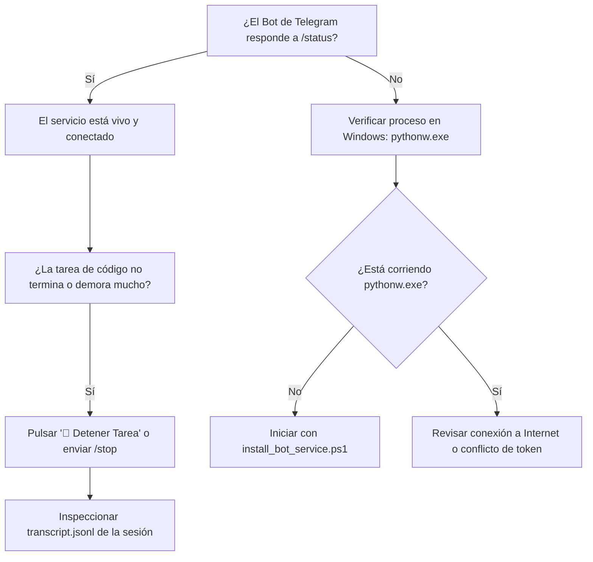

# Guía de Resolución de Problemas, Diagnóstico y Rescate Operativo

> **Manual de contingencia técnica, resolución de incidencias comunes, inspección de procesos y auditoría de logs para Antigravity Telegram Mobile Bridge.**

---

## 1. Mapa Rápido de Diagnóstico (Triage en 60 Segundos)

Si algo no responde como esperas, sigue este árbol de decisión rápido:



---

## 2. Escenarios Comunes y Soluciones Paso a Paso

---

### Escenario A: El Bot no responde a los comandos en Telegram

#### 1. Causa: El proceso de segundo plano se cerró
* **Diagnóstico:** Abre PowerShell en tu laptop y ejecuta:
  ```powershell
  Get-Process pythonw -ErrorAction SilentlyContinue
  ```
* **Solución:** Si no devuelve nada, el servicio no está corriendo. Inícialo con:
  ```powershell
  pwsh -File .\install_bot_service.ps1
  ```

#### 2. Causa: Conflicto de Polling de Telegram (Error 409 Conflict)
* **Diagnóstico:** Ocurre si dejaste una ventana de consola corriendo manualmente `python antigravity_bridge.py` mientras el servicio en segundo plano `pythonw.exe` también estaba activo. Dos instancias no pueden consultar el mismo bot de Telegram a la vez.
* **Solución:** Mata todas las instancias huérfanas y reinicia el servicio limpio:
  ```powershell
  Stop-Process -Name pythonw -Force -ErrorAction SilentlyContinue
  Stop-Process -Name python -Force -ErrorAction SilentlyContinue
  pwsh -File .\install_bot_service.ps1
  ```

#### 3. Causa: El ID de Telegram no está en la Whitelist
* **Diagnóstico:** Si le escribes al bot desde otra cuenta de Telegram, el bot ignora los mensajes silenciosamente por seguridad.
* **Solución:** Verifica que `ANTIGRAVITY_USER_ID` en tu archivo `.env` coincida exactamente con tu ID numérico de Telegram (puedes obtenerlo escribiendo a `@userinfobot` en Telegram).

---

### Escenario B: Una tarea de código parece congelada o demora demasiado

#### 1. Diagnóstico en Vivo desde el Celular
Mira el mensaje de progreso en tiempo real de Telegram:
* Si el texto cambia (*"📝 Editando: Service.ts"*, *"💻 Terminal: git status"*), **el agente está trabajando activamente**, no está congelado.
* Si el texto no cambia y el contador de segundos sigue subiendo, el agente podría estar esperando una red externa o ejecutando un comando de consola pesado.

#### 2. Acción Inmediata: Detención Forzada
Pulsa el botón táctil en Telegram:
`[ 🛑 Detener / Cancelar Tarea ]`
O envía por texto:
```text
/stop
```
El bot activará `kill_process_tree()`, invocando `taskkill /F /T` en Windows para fulminar el proceso de `agy.exe` y todos sus subprocesos hijos de Node y PowerShell en menos de un segundo.

#### 3. ¿Cómo sé qué estaba haciendo el agente?
El historial completo de razonamiento y herramientas de cada sesión se guarda en:
📁 `~/.gemini/antigravity-ide/brain/<ID_SESION>/transcript.jsonl`

Puedes inspeccionar los últimos pasos ejecutados en PowerShell con:
```powershell
Get-Content "$env:USERPROFILE\.gemini\antigravity-ide\brain\<ID_SESION>\transcript.jsonl" -Tail 15
```

---

### Escenario C: Tarea Interrumpida por Inactividad (Timeout de Paso)

El puente no utiliza límites fijos arbitrarios de tiempo total, sino un **Idle Watchdog** inteligente:
* Si durante **600 segundos (10 minutos)** el agente no cambia de paso ni escribe en su registro de actividad, el vigilante asume que un proceso hijo quedó colgado y corta la tarea de forma segura.
* En Telegram recibirás:
  > ⚠️ *Tarea interrumpida por inactividad prolongada.*  
  > `[ ▶️ Continuar Tarea ]`

#### ¿Cómo reanudar sin que empiece de cero?
Simplemente pulsa el botón **`[ ▶️ Continuar Tarea ]`** (o envía `/continue`).
El bot enviará una orden determinística que instruye a la IA a:
1. Inspeccionar los archivos ya editados y los artefactos del cerebro (`brain/`).
2. Descartar las tareas que ya quedaron completas.
3. Continuar directamente con el siguiente paso pendiente.

---

### Escenario D: Error de Formato en Telegram (`Can't parse entities`)

* **Causa:** Antigravity devuelve código con caracteres especiales (`_`, `*`, `[`, `` ` ``) que a veces rompen el parser de Markdown de Telegram.
* **Solución Automática Integrada:** El puente implementa `safe_reply_message()` y `safe_edit_message()`. Si Telegram rechaza el formato Markdown, el bot realiza un **fallback automático instantáneo a texto plano**, garantizando que nunca te quedes sin recibir la respuesta.

---

### Escenario E: Desconexión de Red o Corte de Energía en el Host

* **Si la laptop se desconecta del cargador o hay un corte de luz:**  
  El Watchdog de Batería (`ANTIGRAVITY_WATCHDOG_ENABLED=true`) detecta el cambio de estado en la API Win32 y te envía de inmediato una alerta de emergencia:
  > ⚠️ *Alerta: La laptop se desconectó de la corriente eléctrica. Batería al 85% (~3h 20m restantes).*
* **Si se restablece la energía:**  
  > 🔌 *Energía restaurada: La laptop vuelve a estar conectada a la corriente eléctrica.*
---

### Escenario F: Error 503 UNAVAILABLE (Saturación de Capacidad en Google)

* **Síntoma:** El modelo devuelve `Error: UNAVAILABLE (code 503): No capacity available for model gemini-3.8-flash-high on the server`.
* **Causa:** Los servidores de Google para el modelo solicitado (frecuentemente modelos de razonamiento profundo como `flash-high`) alcanzaron temporalmente su límite global de concurrencia.
* **Mecanismo de Resiliencia del Puente:**  
  El puente analiza la salida de `agy`. Si detecta un error `code 503` o `No capacity available`, **cancela la tarea fallida e inmediatamente la relanza con `gemini-3.8-flash-medium`** notificándote por Telegram. `gemini-3.8-flash-medium` cuenta con enorme disponibilidad y responderá en segundos.

---

### Escenario G: Blindaje Anti-Commits Huérfanos en AutoPush

* **Problema:** Si tienes archivos sin guardar o modificaciones locales en el IDE visual y una tarea remota de Telegram falla o entra en timeout, ¿podría AutoPush commitear accidentalmente tu trabajo del IDE?
* **Solución de Blindaje Estricto:**  
  El puente implementa una **doble compuerta de validación** antes de cualquier commit:
  1. **Validación de Éxito (`code == 0`):** Si la tarea terminó en timeout, error 503 o fue cancelada por el usuario con `/stop`, AutoPush **se desactiva automáticamente** y notifica que los cambios locales no fueron enviados.
  2. **Validación de Archivos Propios (`get_session_modified_files`):** Si la tarea concluyó pero el agente no tocó ningún archivo de código (por ejemplo, solo analizó o diseñó un plan), AutoPush **no tocará Git**, protegiendo cualquier archivo que tú estuvieras editando manualmente en tu computadora.

---

## 3. Comandos de Mantenimiento y Auditoría en Windows

Ejecuta estos comandos en tu laptop para verificar la salud del puente:

### 1. Ver si el proceso está corriendo y cuánta memoria RAM consume
```powershell
Get-Process pythonw | Select-Object Id, ProcessName, @{Name="RAM (MB)"; Expression={[math]::round($_.WS/1MB, 2)}}
```
*(El consumo normal debe situarse entre **35 MB y 55 MB**).*

### 2. Verificar el registro de autoinicio en Windows
```powershell
Get-ItemProperty "HKCU:\Software\Microsoft\Windows\CurrentVersion\Run" -Name "AntigravityTelegramBridge"
```

### 3. Matar procesos huérfanos de compilación (Node / Antigravity)
Si notas la laptop lenta por pruebas antiguas:
```powershell
taskkill /F /IM agy.exe /T 2>$null
taskkill /F /IM node.exe /T 2>$null
```

---

## 4. Auditoría de Sesiones y Diagnóstico de Bases de Datos SQLite

Si alguna sesión no carga sus títulos o deseas inspeccionar el estado:

1. **Rutas oficiales de bases de datos:**
   * `~/.gemini/antigravity-ide/conversation_summaries.db` (Resúmenes e historial del IDE).
   * `~/.gemini/antigravity-ide/conversations/<ID>.db` (Mensajes detallados de cada conversación).
   * `~/.gemini/antigravity-ide/brain/<ID>/transcript.jsonl` (Traza de herramientas y pasos).

2. **Consulta rápida de últimas sesiones en SQLite (desde PowerShell con Python):**
   ```powershell
   python -c "import sqlite3, os; p = os.path.expanduser('~/.gemini/antigravity-ide/conversation_summaries.db'); c = sqlite3.connect(p).cursor(); print('\n'.join([f'{r[0]} | {r[1]}' for r in c.execute('SELECT conversation_id, title FROM conversation_summaries ORDER BY updated_at DESC LIMIT 5').fetchall()]))"
   ```

---

*Documento desarrollado como parte de la infraestructura de ingeniería de **Antigravity Telegram Mobile Bridge**.*  
*Copyright (c) 2026 Gerson Javier Castellanos Niño. Licencia MIT.*
