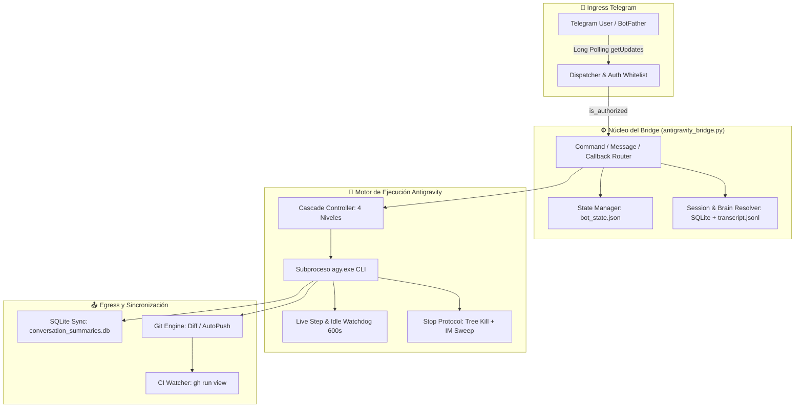
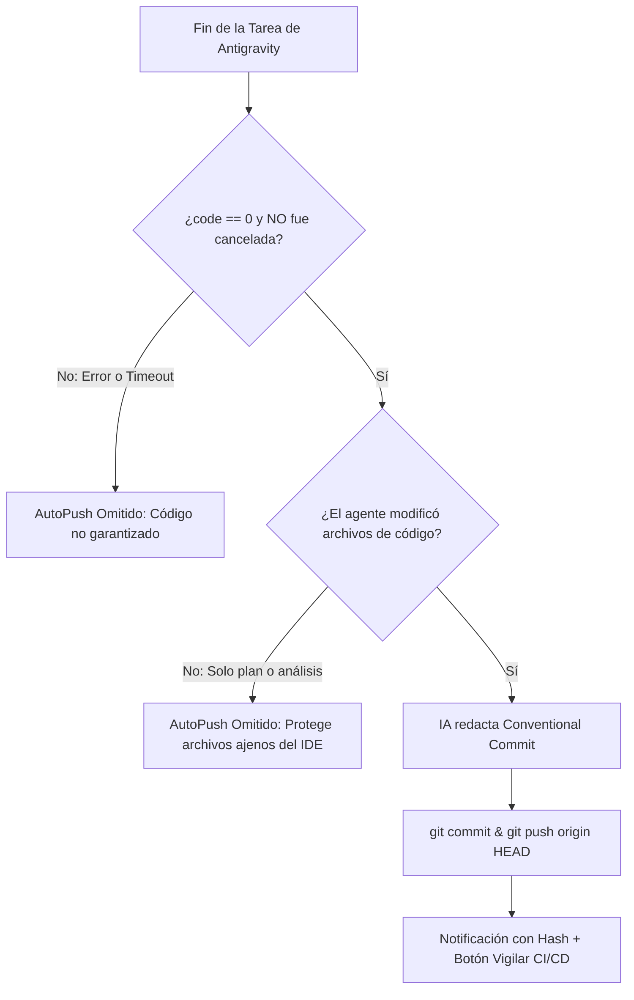

# 📖 Manual Exhaustivo de Comandos, Botones y Flujos Operativos

> **Referencia técnica 100% detallada de todas las capacidades de Antigravity Telegram Mobile Bridge:**  
> Sintaxis de comandos, argumentos, callbacks interactivos de botones, transiciones de estado interno, llamadas a subprocesos, compuertas de seguridad y flujos de trabajo de extremo a extremo.

---

## 📑 Tabla de Contenido

1. [Arquitectura General y Ciclo de Vida del Puente](#1-arquitectura-general-y-ciclo-de-vida-del-puente)
2. [Catálogo Exhaustivo de Comandos (37 Comandos y Alias)](#2-catálogo-exhaustivo-de-comandos-37-comandos-y-alias)
   - [A. Inicialización, Seguridad y Dashboard](#a-inicialización-seguridad-y-dashboard)
   - [B. Navegación Multi-Proyecto](#b-navegación-multi-proyecto)
   - [C. Gestión de Sesiones y Modo Hilo Limpio](#c-gestión-de-sesiones-y-modo-hilo-limpio)
   - [D. Control de Ejecución y Cancelación](#d-control-de-ejecución-y-cancelación)
   - [E. Planificación, Aprobación y Modo de Ejecución](#e-planificación-aprobación-y-modo-de-ejecución)
   - [F. Control de Versiones Git Móvil](#f-control-de-versiones-git-móvil)
   - [G. Automatización, CI/CD y Healthcheck](#g-automatización-cicd-y-healthcheck)
   - [H. Hardware, Telemetría y Consola](#h-hardware-telemetría-y-consola)
   - [I. Prompts Directos y Detección Multimodal](#i-prompts-directos-y-detección-multimodal)
3. [Catálogo Exhaustivo de Botones Táctiles (Inline Keyboards)](#3-catálogo-exhaustivo-de-botones-táctiles-inline-keyboards)
   - [Matriz de Botones, Callbacks y Acciones Internas](#matriz-de-botones-callbacks-y-acciones-internas)
4. [Flujos Operativos de Extremo a Extremo](#4-flujos-operativos-de-extremo-a-extremo)
   - [Flujo 1: Modo Directo vs. Modo Plan (El Antipatrón del Plan Persistente y Smart Approval)](#flujo-1-modo-directo-vs-modo-plan-el-antipatrón-del-plan-persistente-y-smart-approval)
   - [Flujo 2: Cascada Automática Multimodelo ante Saturación (Error 503)](#flujo-2-cascada-automática-multimodelo-ante-saturación-error-503)
   - [Flujo 3: Telemetría en Vivo, Idle Watchdog y Protocolo de Parada Forzada](#flujo-3-telemetría-en-vivo-idle-watchdog-y-protocolo-de-parada-forzada)
   - [Flujo 4: Reanudación Determinística de Emergencia](#flujo-4-reanudación-determinística-de-emergencia)
   - [Flujo 5: Turbo AutoPush con Doble Blindaje](#flujo-5-turbo-autopush-con-doble-blindaje)
   - [Flujo 6: Sincronización Bidireccional de Sesiones (CLI 🔄 IDE)](#flujo-6-sincronización-bidireccional-de-sesiones-cli--ide)
   - [Flujo 7: Watchdog de Batería y Cortes de Luz](#flujo-7-watchdog-de-batería-y-cortes-de-luz)

---

## 1. Arquitectura General y Ciclo de Vida del Puente

El puente opera como un servicio en segundo plano de Windows (`pythonw.exe` o `pyw.exe -3`) sin interfaz gráfica de usuario (`CREATE_NO_WINDOW`), consumiendo ~40 MB de memoria RAM.



### Persistencia de Estado (`bot_state.json` e `in_flight_task.json`)
El puente utiliza dos mecanismos complementarios de persistencia en disco:

1. **`bot_state.json` (Estado Operativo Global):** Reside en el directorio base del bot y preserva la configuración operativa entre reinicios:
* `current_project`: Ruta absoluta del repositorio activo (`str` o `null`).
* `active_session_id`: UUID de la conversación activa (`str` o `null` para Modo Hilo Limpio).
* `active_session_title`: Título legible de la sesión activa (`str` o `null`).
* `model`: Modelo de IA seleccionado (`"auto"`, `"gemini-3.8-flash-high"`, etc.).
* `execution_mode`: Modo de ejecución (`"accept-edits"` o `"plan"`).
* `autopush`: Bandera booleana de commit y push automático (`true` o `false`).

2. **`in_flight_task.json` (Vigilante de Tarea Activa en Vuelo):** Archivo efímero creado en el instante exacto en que Antigravity comienza a procesar una orden y eliminado cuando concluye o se cancela. Registra:
* `chat_id`: Identificador de Telegram donde se debe reportar.
* `status_msg_id`: ID del mensaje interactivo de telemetría en tiempo real.
* `start_time`: Timestamp de inicio para calcular duraciones.
* `prompt`: Requerimiento original del usuario.
* `target_session`: Identificador UUID de la conversación.
* `project`: Ruta del proyecto activo.
* `model`: Modelo de IA utilizado.
* **Propósito:** Si el daemon o la máquina se reinician abruptamente durante una ejecución pesada, el hook `recover_in_flight_task()` detecta este archivo al arrancar, limpia el mensaje congelado en Telegram, extrae el resultado del transcript y entrega la respuesta final sin pérdida de información.

---

## 2. Catálogo Exhaustivo de Comandos (40 Comandos y Alias)

---

### A. Inicialización, Seguridad y Dashboard

#### 1. `/start`
* **Descripción:** Inicializa la sesión con el bot, comprueba la autorización del usuario y despliega la botonera de bienvenida.
* **Manejador interno:** `cmd_start(update, context)`
* **Comprobación de Seguridad:** `is_authorized(update)` compara el `user_id` de Telegram contra `ANTIGRAVITY_USER_ID` del `.env`. Si no coincide, descarta silenciosamente la petición sin responder.
* **Salida UI:** Mensaje de bienvenida con atajos táctiles directos a `[ 📁 Seleccionar Proyecto ]`, `[ 📊 Ver Estado ]`, y `[ ❓ Ayuda ]`.

#### 2. `/status`
* **Descripción:** Panel de control central del sistema.
* **Manejador interno:** `cmd_status(update, context)` y `show_status_view(query)`
* **Acciones internas ejecutadas:**
  1. Consulta `psutil` o APIs nativas de Windows para calcular la memoria RAM libre y consumida.
  2. Invoca `get_power_status()` mediante `GetSystemPowerStatus` de Windows Kernel32 para determinar fuente eléctrica (AC o batería) y porcentaje de carga.
  3. Comprueba el estado de Git en el proyecto activo (`git branch --show-current`, `git status --porcelain`).
  4. Detecta si la sesión activa cuenta con `implementation_plan.md` o `walkthrough.md` en su carpeta de cerebro (`~/.gemini/antigravity-ide/brain/<ID>/`).
* **Botonera Inline asociada:**
  - `[ 📁 Proyectos ]` (`btn_projects`)
  - `[ 💬 Sesiones ]` (`btn_sessions`)
  - `[ ⚡ AutoPush: ON/OFF ]` (`toggle_autopush`)
  - `[ 🚀 CI/CD ]` (`btn_ci`)
  - `[ 🌐 Health ]` (`btn_health`)
  - `[ 🌿 Ramas ]` (`btn_branches`)
  - `[ 🔋 Batería ]` (`btn_battery`)
  - `[ 🤖 Modelo ]` (`btn_models`)
  - `[ ⚙️ Modo ]` (`btn_mode`)
  - `[ 🧠 Ver Plan ]` (`view_plan`) *(si existe plan)*
  - `[ 📋 Walkthrough ]` (`view_walkthrough`) *(si existe informe)*
  - `[ 🔍 Ver Diff ]` (`view_diff`) *(si hay cambios locales en Git)*

#### 3. `/?`, `/help`, `/ayuda`
* **Descripción:** Guía de referencia contextual sensible al estado actual.
* **Manejador interno:** `cmd_help(update, context)`
* **Comportamiento adaptativo:** Si no hay proyecto seleccionado, prioriza comandos de selección de proyecto. Si hay proyecto activo, despliega los comandos de sesiones, Git, planificación y ejecución.

---

### B. Navegación Multi-Proyecto

#### 4. `/projects`, `/switch_project`
* **Descripción:** Escanea los directorios configurados en `ANTIGRAVITY_WORKSPACE_ROOTS` y genera una botonera con todos los repositorios Git encontrados.
* **Manejador interno:** `cmd_projects(update, context)`
* **Acciones internas ejecutadas:**
  1. Limpia `state.project_cache`.
  2. Recorre las rutas de `WORKSPACE_ROOTS` buscando carpetas que contengan `.git`.
  3. Asigna un índice numérico (`proj_0`, `proj_1`, ...) a cada repositorio para respetar el límite de 64 bytes de `callback_data` de Telegram.
  4. Muestra un indicador visual `👉` en el proyecto activo actual.

#### 5. `/exit_project`, `/close_project`
* **Descripción:** Desvincula el proyecto activo actual y devuelve el bot al estado neutral.
* **Manejador interno:** `cmd_exit_project(update, context)`
* **Acciones internas ejecutadas:**
  1. Establece `state.current_project = None`.
  2. Establece `state.active_session_id = None`.
  3. Establece `state.active_session_title = None`.
  4. Guarda el estado en `bot_state.json`.
  5. Despliega la lista de proyectos disponibles para seleccionar uno nuevo.

#### 5b. `/newproject [nombre]`, `/crearproyecto [nombre]`
* **Descripción:** Permite crear un nuevo proyecto desde Telegram seleccionando la carpeta padre configurada (`ANTIGRAVITY_WORKSPACE_ROOTS`) e inicializando Git de inmediato.
* **Manejador interno:** `cmd_new_project(update, context)`, `create_new_project(...)`
* **Acciones internas ejecutadas:**
  1. Si no se especifica nombre o carpeta padre, presenta botones interactivos con las carpetas raíz (`WORKSPACE_ROOTS`).
  2. Solicita el nombre de la carpeta interna mediante el flujo interactivo seguro (`USER_FLOWS`).
  3. Crea el directorio con `os.makedirs`.
  4. Inicializa el repositorio con `git init -b main`.
  5. Crea `.gitignore` y `README.md` predeterminados.
  6. Fija el nuevo directorio como `state.current_project` e inicia en modo hilo limpio (`active_session_id = None`).
  7. Ofrece botones inmediatos para enlazar a GitHub (`[ 🔗 Enlazar a GitHub ]`), hacer el primer commit (`[ 🚀 Primer Commit ]`) o comenzar a programar (`[ 💬 Comenzar a Programar ]`).


---

### C. Gestión de Sesiones y Modo Hilo Limpio

#### 6. `/sessions`, `/switch_session`
* **Descripción:** Lista las conversaciones previas guardadas correspondientes al proyecto activo.
* **Manejador interno:** `cmd_sessions(update, context)`
* **Acciones internas ejecutadas:**
  1. Consulta `conversation_summaries.db` del perfil unificado (`antigravity-ide`).
  2. Cruza con `state.vscdb` de VS Code para recuperar los títulos asignados por el IDE.
  3. Filtra rigurosamente las sesiones que pertenecen a la ruta del proyecto actual (aislamiento multi-proyecto).
  4. Genera botones táctiles para las 5 sesiones más recientes (`ses_<UUID>`) y añade el botón especial `[ ➕ Iniciar Hilo Limpio ]` (`ses_NEW`).

#### 7. `/session <uuid>`
* **Descripción:** Conecta directamente a una sesión específica mediante su identificador UUID.
* **Manejador interno:** `cmd_direct_session(update, context)`
* **Acciones internas ejecutadas:**
  1. Valida la existencia del ID en las bases de datos de SQLite o carpetas de cerebro.
  2. Actualiza `state.active_session_id` y `state.active_session_title`.
  3. Invoca `load_and_present_session()`, extrayendo la última interacción (mensaje del usuario y conclusión del agente).
  4. Ofrece botones contextuales si la sesión tiene `implementation_plan.md` (`[ 🧠 Ver Plan ]`, `[ ▶️ Ejecutar Plan ]`) o `walkthrough.md`.

#### 8. `/exit_session`, `/leave`, `/close_session`, `/new`
* **Descripción:** Sale de la sesión activa y entra en **Modo Hilo Limpio**.
* **Manejador interno:** `cmd_exit_session(update, context)` y `cmd_new_session(update, context)`
* **Acciones internas ejecutadas:**
  1. Pone `state.active_session_id = None` y `state.active_session_title = None`.
  2. Guarda `bot_state.json`.
  3. El próximo mensaje enviado por el usuario no arrastrará historial previo y provocará que `agy` cree una conversación totalmente fresca en el proyecto activo.

---

### D. Control de Ejecución y Cancelación

#### 9. `/stop`, `/cancel`, `/detener`, `/cancelar`
* **Descripción:** Protocolo de parada forzada inmediata para abortar tareas desbordadas o bucles infinitos.
* **Manejador interno:** `cmd_stop(update, context)`
* **Acciones internas ejecutadas (`stop_task_now()`):**
  1. Activa la bandera global `TASK_CANCEL_REQUESTED = True`.
  2. Si existe un proceso activo registrado en `CURRENT_TASK_PROC`, ejecuta `kill_process_tree(proc.pid)` mediante `taskkill /F /T /PID <pid>` en Windows.
  3. **Barrido forzoso de huérfanos:** Ejecuta `taskkill /F /IM agy.exe /T` para eliminar cualquier subproceso hijo de `agy`, Node.js o MCP que haya quedado desconectado de la tubería.
  4. **Bloqueo inviolable:** Establece `was_cancelled = True`. Esto **bloquea inmediatamente la cascada multimodelo** (impide que salte al siguiente modelo) y **desactiva de raíz el AutoPush**, garantizando que nada se commitee a Git.
  5. Envía notificación de confirmación a Telegram.

#### 10. `/continue`, `/continuar`
* **Descripción:** Reanuda una tarea interrumpida por caída o timeout sin repetir el trabajo ya hecho.
* **Manejador interno:** `cmd_continue(update, context)`
* **Comportamiento:**
  1. Requiere que exista una sesión activa (`state.active_session_id`).
  2. Inyecta el prompt determinístico `CONTINUE_TASK_PROMPT`:
     > *"Continúa con la tarea inmediatamente donde la dejaste. Inspecciona los archivos modificados y el progreso previo en el cerebro/transcript. NO repitas trabajo ya completado; procede directamente con el siguiente paso pendiente hasta concluir la meta."*
  3. `agy` retoma la sesión directamente desde el estado guardado en su base de datos SQLite y `transcript.jsonl`.

#### 11. `/recover`, `/recuperar`
* **Descripción:** Protocolo de recuperación manual de resultados. Si el bot se reinició, la laptop se suspendió o el mensaje de Telegram quedó desincronizado mientras Antigravity trabajaba, este comando fuerza la inspección del cerebro local y envía el último informe completado.
* **Manejador interno:** `cmd_recover(update, context)`
* **Acciones internas ejecutadas:**
  1. Identifica la sesión activa o, en su defecto, detecta la carpeta más reciente en `~/.gemini/antigravity-cli/brain/` mediante `get_newest_brain_session_id(preferred_root=CLI_BRAIN_DIR)`.
  2. Lee el último `PLANNER_RESPONSE` completo sin llamadas a herramientas desde `transcript.jsonl`.
  3. Actualiza y persiste la sesión en `bot_state.json` y sincroniza hacia el entorno del IDE con `sync_cli_to_ide()`.
  4. Inspecciona cambios pendientes en Git (`git diff --stat`) y presencia de planes/walkthroughs.
  5. Envía a Telegram el informe formateado completo junto a la botonera de acciones (`🧠 Ver Plan`, `🔍 Ver Diff`, `✅ Commit & Push`, `📊 Panel de Estado`).

---

### E. Planificación, Aprobación y Modo de Ejecución

#### 11. `/plan [tarea]`
* **Descripción:** Atajo de planificación bajo demanda. Si se pasa un texto, ejecuta Antigravity forzando el modo planificador. Si se invoca sin texto, muestra el `implementation_plan.md` de la sesión activa.
* **Manejador interno:** `cmd_plan(update, context)`
* **Acciones internas ejecutadas:**
  - Si hay texto: Inyecta el **Guardián de Modo Plan Estricto** en el prompt del agente y ejecuta con `--mode plan`. Esto prohíbe tocar archivos de código y neutraliza el gancho de auto-aprobación del CLI (`Stop hook blocked termination`).
  - Al concluir, localiza `implementation_plan.md` en el cerebro y lo envía formateado a Telegram, adjuntando el botón interactivo `[ ▶️ Ejecutar Plan ]`.
  - Si el plan supera 3500 caracteres, envía un extracto en el mensaje y adjunta el archivo completo `.md` descargable.

#### 12. `/approve`, `/aprobar`, `/exec`, `/ejecutar`
* **Descripción:** Aprueba formalmente el plan de arquitectura vigente y ordena a Antigravity comenzar la implementación inmediata en modo directo (`accept-edits`).
* **Manejador interno:** `cmd_approve(update, context)`
* **Acciones internas ejecutadas:**
  1. Comprueba que exista `implementation_plan.md` en la sesión activa.
  2. Conmuta el modo de ejecución a `accept-edits` y guarda `bot_state.json`.
  3. Despacha el prompt formal de aprobación:
     > *"El plan de implementación ha sido formalmente revisado y APROBADO por el usuario. Por favor procede de inmediato a ejecutar paso a paso todas las modificaciones de código, creación de componentes, pruebas y verificación según lo especificado en el plan."*
  4. Antigravity comienza la edición física de archivos, compilaciones y pruebas.

#### 13. `/mode`, `/modos`
* **Descripción:** Menú interactivo para conmutar el modo de ejecución predeterminado del bot.
* **Manejador interno:** `cmd_mode(update, context)`
* **Opciones disponibles:**
  - `⚡ Directo (accept-edits)`: Modo estándar y recomendado. El agente investiga, edita archivos y valida en un solo ciclo ReAct continuo.
  - `🧠 Planificación (plan)`: Modo restrictivo. Cada mensaje genera exclusivamente un documento de propuesta arquitectónica sin tocar código.

#### 14. `/walkthrough`
* **Descripción:** Inspecciona y envía el informe de tareas finalizadas (`walkthrough.md`) generado por el agente al término de la misión.
* **Manejador interno:** `cmd_walkthrough(update, context)`
* **Acciones internas ejecutadas:** Busca el artefacto en el cerebro de la sesión activa y lo presenta en Telegram. Si supera los límites de tamaño, lo adjunta como documento Markdown.

---

### F. Control de Versiones Git Móvil

#### 15. `/diff`
* **Descripción:** Visualizador inteligente de diferencias sintácticas en el repositorio.
* **Manejador interno:** `cmd_diff(update, context)`
* **Capacidades especiales integradas:**
  1. **Rastreo de archivos no versionados:** Ejecuta internamente `git add -N .` para que los archivos recién creados por la IA no sean ignorados por `git diff`.
  2. **Inspección en árbol limpio (Soporte AutoPush):** Si AutoPush ya commiteó los cambios de la sesión hace unos segundos, el árbol de trabajo estará limpio. El comando detecta esto y extrae automáticamente `git show --stat HEAD` y `git show -p HEAD` para mostrar las modificaciones recién empaquetadas.
  3. **Envío inteligente:** Si el diff es menor a 3800 caracteres, lo renderiza en el chat con bloques de color `diff`. Si es más extenso, genera y adjunta un archivo `.diff` descargable.
  4. Botonera adjunta: `[ ✅ Commit & Push ]` (`approve_push`) y `[ 🗑️ Revertir Cambios ]` (`revert_prompt`).

#### 16. `/commit [mensaje]`
* **Descripción:** Empaqueta y envía las modificaciones locales al repositorio remoto (`origin HEAD`).
* **Manejador interno:** `cmd_commit(update, context)`
* **Acciones internas ejecutadas:**
  1. Si el usuario escribe un mensaje (ej: `/commit feat(auth): add jwt support`), utiliza dicho texto como mensaje del commit.
  2. Si el usuario no escribe mensaje (`/commit` a secas), invoca a Antigravity en modo ultra-rápido (`--disable-slash-commands`, timeout 90s) para que analice el `git diff` y redacte un mensaje formal siguiendo la convención de *Conventional Commits* (`feat(...)`, `fix(...)`, `docs(...)`).
  3. Ejecuta `git add -A` y `git commit -m "..."`.
  4. Ejecuta `git push origin HEAD`.
  5. Extrae el hash abreviado del commit y ofrece el botón `[ 👁️ Vigilar Fin de Deploy ]` para monitorizar el pipeline de CI/CD.

#### 17. `/revert`
* **Descripción:** Descarta de forma segura las modificaciones locales no deseadas.
* **Manejador interno:** Callback interactivo de seguridad `revert_prompt`.
* **Protección:** No revierte de inmediato; solicita confirmación táctil con `[ ⚠️ SÍ, Revertir Todo ]` (`revert_do`) o `[ Cancelar ]` (`revert_cancel`).
* **Comandos ejecutados al confirmar:** `git restore .` seguido de `git clean -fd`.

#### 18. `/branches`, `/ramas`
* **Descripción:** Muestra las ramas locales del repositorio ordenadas por actividad reciente.
* **Manejador interno:** `cmd_branches(update, context)`
* **Acciones internas ejecutadas:** Ejecuta `git for-each-ref` calculando el tiempo relativo (*hace 15m*, *hace 2 días*) y despliega botones táctiles `[ 🔀 Cambiar a <rama> ]` (`branch_co_<nombre>`) para cambiar de rama en un solo toque.

#### 19. `/branch <nombre>`, `/rama <nombre>`
* **Descripción:** Cambia a una rama existente o crea una nueva rama a partir del commit actual.
* **Manejador interno:** `cmd_branch(update, context)`
* **Acciones internas ejecutadas:** Ejecuta `git checkout <nombre>` o `git checkout -b <nombre>`.

#### 19b. `/firstcommit [mensaje]`, `/primercommit [mensaje]`
* **Descripción:** Realiza el primer commit formal en un repositorio recién creado o sin historial y lo empuja estableciendo upstream (`git push -u origin <branch>`).
* **Manejador interno:** `cmd_first_commit(update, context)` y `do_first_commit(update, context, custom_msg)`
* **Acciones internas ejecutadas:**
  1. Verifica el estado del repositorio mediante `get_git_status_details()`.
  2. Si la rama no es `main`, la renombra con `git branch -M main`.
  3. Ejecuta `git add -A`.
  4. Crea el commit inicial (`Initial commit` o mensaje personalizado).
  5. Si tiene remoto `origin`, ejecuta `git push -u origin main`.
  6. Si no tiene remoto configurado, preserva el commit localmente e invita a vincular GitHub con el botón `[ 🔗 Enlazar a GitHub ]`.

#### 19c. `/github`, `/repo`
* **Descripción:** Centro de control integral de GitHub y repositorios remotos. Muestra el estado del remoto, protocolo activo (HTTPS / SSH), identidad de autor y botones de sincronización.
* **Manejador interno:** `cmd_github(update, context)` y `build_github_view(repo_path)`
* **Acciones internas ejecutadas:**
  1. Ejecuta diagnóstico profundo (`get_git_status_details()`): rama actual, commits locales, hash HEAD, URL remota y estado de sincronización (`SIN REPOSITORIO GIT`, `SIN COMMITS AÚN`, `SÓLO LOCAL`, `AL DÍA`, `ADELANTADO`, `ATRASADO`).
  2. Muestra badge de protocolo (`🔒 SSH: git@github.com:...` o `🌐 HTTPS: https://github.com/...`).
  3. Despliega botonera inteligente adaptada al estado:
     - Si no hay remoto: `[ 🌐 Crear Repo en GitHub ]`, `[ 🔗 Vincular Remoto ]`, `[ 👤 Cambiar Identidad Git ]`.
     - Si no hay commits: `[ 🚀 Primer Commit & Push ]`.
     - Si hay cambios pendientes: `[ 🔍 Ver Diff ]`.
     - Si hay commits por subir: `[ ⬆️ Empujar (Push) ]`.
     - Si está configurado: `[ 🔄 Sincronizar (Fetch) ]`.

---

### G. Automatización, CI/CD y Healthcheck

#### 20. `/autopush`
* **Descripción:** Conmuta el estado del modo **Turbo AutoPush**.
* **Manejador interno:** `cmd_autopush(update, context)` y `toggle_autopush`
* **Comportamiento:** Alterna `state.autopush` entre `true` y `false`. Cuando está activo (`ON`), cada tarea que concluya con éxito y genere modificaciones de código en el proyecto activo ejecutará de forma automática el commit asistido por IA y el push a `origin HEAD`.

#### 21. `/ci`, `/cicd`
* **Descripción:** Consulta el estado en tiempo real del pipeline de integración y despliegue continuo en **GitHub Actions**.
* **Manejador interno:** `cmd_ci(update, context)` y `build_ci_view()`
* **Acciones internas ejecutadas:**
  1. Requiere GitHub CLI (`gh`) autenticado en el sistema anfitrión.
  2. Ejecuta `gh run list --limit 5 --json databaseId,status,conclusion,workflowName,headBranch,createdAt`.
  3. Muestra los estados visuales: `🟡 En progreso`, `🟢 Exitoso`, `🔴 Fallido`.
  4. Si hay un run en progreso, ofrece el botón `[ 👁️ Vigilar Fin de Deploy ]` (`ci_watch_<run_id>`).
  5. Si el último run falló, ofrece el botón `[ 📋 Ver Log de Error ]` (`ci_logs_<run_id>`) que extrae `gh run view <id> --log-failed`.

#### 22. `/health [url]`, `/ping [url]`
* **Descripción:** Comprueba la disponibilidad en vivo, código HTTP y latencia de red de una aplicación web.
* **Manejador interno:** `cmd_health(update, context)` y `check_web_health(url)`
* **Acciones internas ejecutadas:**
  1. Si no se especifica URL, utiliza `ANTIGRAVITY_DEFAULT_HEALTH_URL`.
  2. Realiza una petición HTTP/HTTPS mediante `urllib.request` midiendo el tiempo de respuesta exacto en milisegundos.
  3. Reporta: Estado (200 OK), latencia en ms, y validación de certificado SSL.

---

### H. Hardware, Telemetría y Consola

#### 23. `/battery`, `/power`, `/bateria`
* **Descripción:** Consulta la telemetría de energía y batería de la máquina anfitriona.
* **Manejador interno:** `cmd_battery(update, context)` y `get_power_status()`
* **Acciones internas ejecutadas:** Invoca la función de la API de Windows Win32 `kernel32.GetSystemPowerStatus`:
  - `ACLineStatus`: 1 = Enchufado a la red eléctrica (AC), 0 = En batería.
  - `BatteryLifePercent`: Porcentaje restante de 0 a 100%.
  - `BatteryLifeTime`: Segundos estimados de autonomía restante.

#### 24. `/models`
* **Descripción:** Selector visual de modelos de Inteligencia Artificial para el CLI.
* **Manejador interno:** `cmd_models(update, context)`
* **Modelos soportados:**
  - `auto`: Selector inteligente automático (Gemini 3.8 Flash Medium para tareas rápidas/UI y Flash High para arquitectura).
  - `gemini-3.8-flash-high`: Máximo razonamiento de Google.
  - `gemini-3.8-flash-medium`: Velocidad de desarrollo intermedio.
  - `gemini-3.7-flash-high`: Ultra-estable y rápido.
  - `claude-sonnet-4-6`: Máxima capacidad de programación de Anthropic.
  - `claude-opus-4-6-thinking`: Razonamiento profundo de Anthropic.

#### 25. `/cmd <comando>`
* **Descripción:** Terminal remota de administración para ejecutar cualquier orden en el sistema anfitrión dentro del directorio del proyecto activo.
* **Manejador interno:** `cmd_custom_command(update, context)`
* **Acciones internas ejecutadas:** Ejecuta la orden en PowerShell (`pwsh` o `cmd`), captura `stdout` y `stderr` con un timeout de seguridad y devuelve la salida formateada en un bloque de código a Telegram.

---

### I. Prompts Directos y Detección Multimodal

#### 26. Envío de Mensaje de Texto Directo
* **Descripción:** Cualquier mensaje que no comience con `/` es interpretado como un requerimiento de desarrollo para Antigravity.
* **Manejador interno:** `handle_message(update, context)`
* **Procesamiento previo inteligente:**
  - **Detección de Aprobación de Plan:** Si el mensaje contiene palabras clave como `"aprobado"`, `"comencemos"`, `"proceder"`, `"ejecuta el plan"` y el modo activo estaba en `plan`, el puente **desbloquea automáticamente el modo directo (`accept-edits`)**, guarda la configuración y arranca la implementación física sin requerir comandos adicionales.
  - **Inyección de Workspace y Sesión:** Configura el directorio de trabajo (`cwd`), el perfil de datos (`--app_data_dir antigravity-ide`) y la sesión activa para que el IDE de escritorio refleje todo en tiempo real.

#### 27. Envío de Fotografías / Capturas de Pantalla 📸
* **Descripción:** Análisis multimodal de capturas de pantalla de bugs, interfaces desalineadas o esquemas.
* **Manejador interno:** `handle_photo(update, context)`
* **Acciones internas ejecutadas:**
  1. Descarga la foto en máxima resolución en el directorio temporal `./temp_media/`.
  2. Invoca a Antigravity pasando la ruta absoluta de la imagen como contexto multimodal.
  3. El modelo analiza el diseño visual, correlaciona con el código fuente del repositorio y genera la solución o modificación requerida.

---

## 3. Catálogo Exhaustivo de Botones Táctiles (Inline Keyboards)

Todos los botones interactivos del bot operan mediante el protocolo `CallbackQuery` de Telegram. A continuación se detalla la totalidad de los callbacks implementados:

### Matriz de Botones, Callbacks y Acciones Internas

| Botón Visible | Callback Data | Vista Origen | Acción Interna en Python (`handle_callback`) |
|---|---|---|---|
| `[ 📁 Proyectos ]` | `btn_projects` | `/status`, `/start` | Escanea repositorios en `WORKSPACE_ROOTS` y abre el menú de selección de proyecto. |
| `[ ➕ Crear Nuevo Proyecto ]` | `btn_new_project` | Selector de Proyectos | Despliega selector de carpetas raíz para crear un nuevo proyecto. |
| `[ 📁 <Carpeta Raíz> ]` | `newproj_root_<idx>` | Selector de Raíces | Inicia el flujo conversacional solicitando el nombre de la subcarpeta interna. |
| `[ Abrir <Nombre> ]` | `proj_<idx>` | Selector de Proyectos | Fija `state.current_project = ruta`, resetea la sesión activa y guarda `bot_state.json`. |
| `[ 💬 Sesiones ]` | `btn_sessions` | `/status` | Escanea SQLite del IDE y despliega las 5 conversaciones más recientes del proyecto. |
| `[ 📌 <Título> ]` | `ses_<UUID>` | Selector de Sesiones | Fija `state.active_session_id = UUID`, carga la última interacción y muestra botones de plan/walkthrough. |
| `[ ➕ Iniciar Hilo Limpio ]` | `ses_NEW` | Selector de Sesiones | Desvincula la sesión activa, activa el Modo Hilo Limpio y guarda `bot_state.json`. |
| `[ ⚡ AutoPush: ON/OFF ]` | `toggle_autopush` | `/status` | Invierte el booleano `state.autopush` (`True` $\leftrightarrow$ `False`), persiste y actualiza la vista. |
| `[ 🛑 Detener / Cancelar Tarea ]` | `stop_current_task` | Telemetría en Vivo | Invoca `stop_task_now()`, ejecuta `kill_process_tree()` y `taskkill /F /IM agy.exe /T`, fijando `was_cancelled = True`. |
| `[ ▶️ Continuar Tarea ]` | `continue_task` | Tarea Interrumpida | Despacha `CONTINUE_TASK_PROMPT` a `agy` para reanudar sin repetir trabajo previo. |
| `[ 🧠 Ver Plan ]` | `view_plan` | `/status`, Notificación | Ejecuta `cmd_plan` mostrando el contenido de `implementation_plan.md`. |
| `[ ▶️ Ejecutar Plan ]` | `exec_plan` | Vista de Plan, Notificación | Conmuta a modo `accept-edits`, guarda estado y envía el prompt de ejecución a `agy`. |
| `[ 📋 Walkthrough ]` | `view_walkthrough` | `/status`, Notificación | Ejecuta `cmd_walkthrough` presentando el informe de tareas finalizadas. |
| `[ ⚙️ Modo ]` | `btn_mode` | `/status` | Abre el selector de modos de ejecución (`accept-edits` vs `plan`). |
| `[ ⚡ Directo (accept-edits) ]` | `set_mode:accept-edits` | Selector de Modo | Establece `state.execution_mode = "accept-edits"` y guarda `bot_state.json`. |
| `[ 🧠 Planificación (plan) ]` | `set_mode:plan` | Selector de Modo | Establece `state.execution_mode = "plan"` y guarda `bot_state.json`. |
| `[ 🤖 Modelo ]` | `btn_models` | `/status` | Abre el catálogo de modelos de Inteligencia Artificial disponibles. |
| `[ <Nombre del Modelo> ]` | `model_<id>` | Selector de Modelos | Fija `state.model = id` (ej: `auto`, `gemini-3.8-flash-high`) y guarda estado. |
| `[ 🔍 Ver Diff ]` | `view_diff` | `/status`, Éxito Tarea | Ejecuta `cmd_diff`, inspecciona cambios locales o del último commit y muestra el diff. |
| `[ ✅ Commit & Push ]` | `approve_push` | Vista de Diff | Invoca `do_commit_and_push()`, empaqueta cambios con IA y empuja a `origin HEAD`. |
| `[ 🗑️ Revertir Cambios ]` | `revert_prompt` | Vista de Diff | Muestra el diálogo de confirmación de seguridad para descartar cambios. |
| `[ ⚠️ SÍ, Revertir Todo ]` | `revert_do` | Confirmación Revert | Ejecuta `git restore .` y `git clean -fd` limpiando el directorio de trabajo. |
| `[ Cancelar ]` | `revert_cancel` | Confirmación Revert | Cancela la reversión dejando los archivos intactos. |
| `[ 🌿 Ramas ]` | `btn_branches` | `/status` | Ejecuta `build_branches_view()` y lista las ramas locales recientes. |
| `[ 🔀 Cambiar a <Rama> ]` | `branch_co_<nombre>` | Selector de Ramas | Ejecuta `git checkout <nombre>` y confirma el cambio de rama activa. |
| `[ 🐙 GitHub ]` | `btn_github` | `/status`, Proyectos | Despliega la tarjeta diagnóstica de Git y opciones de GitHub. |
| `[ 🌐 Crear Repo en GitHub ]` | `gh_choose_create_profile` | Vista de GitHub | Permite elegir identidad (Personal HTTPS o Trabajo SSH) para crear repo. |
| `[ 👤 <Perfil> ]` | `gh_create_prof:<key>` | Asistente de Creación | Selecciona el perfil y solicita visibilidad (Privado o Público). |
| `[ 🔒 Privado / 🌍 Público ]` | `gh_create_vis:...` | Asistente de Creación | Configura visibilidad y pregunta si usar nombre actual o personalizado. |
| `[ 🚀 Crear con Nombre Actual ]` | `gh_create_do:...` | Asistente de Creación | Crea el repo en GitHub vía `gh` o SSH y vincula `origin`. |
| `[ 🔗 Vincular Remoto ]` | `gh_prompt_link_remote` | Vista de GitHub | Ofrece vincular por HTTPS o SSH solicitando la URL o repositorio remoto. |
| `[ 👤 Cambiar Identidad Git ]` | `gh_switch_identity` | Vista de GitHub | Muestra las identidades configuradas para cambiar el autor del repo local. |
| `[ 🚀 Primer Commit & Push ]` | `gh_first_commit` | Vista de GitHub | Ejecuta `git branch -M main`, `git add -A`, `git commit` y `git push -u origin main`. |
| `[ ⬆️ Empujar (Push) ]` | `gh_push_remote` | Vista de GitHub | Ejecuta `git push origin <rama>` sincronizando commits pendientes. |
| `[ 🔄 Sincronizar (Fetch) ]` | `gh_fetch_remote` | Vista de GitHub | Ejecuta `git fetch origin` y refresca el estado del repositorio. |
| `[ 💬 Comenzar a Programar ]` | `start_coding` | Creación de Proyecto | Cambia a modo hilo limpio e invita a ingresar el primer requerimiento de código. |
| `[ ❌ Cancelar Flujo ]` | `cancel_flow` | Asistentes Activos | Aborta cualquier flujo conversacional en curso (`USER_FLOWS`). |
| `[ 🚀 CI/CD ]` | `btn_ci` | `/status`, Health | Consulta GitHub Actions vía `gh run list` y despliega el estado del pipeline. |
| `[ 🔄 Refrescar CI/CD ]` | `ci_refresh` | Vista de CI/CD | Reejecuta la consulta a GitHub Actions y actualiza el mensaje. |
| `[ 👁️ Vigilar Fin de Deploy ]` | `ci_watch_<id>` | CI/CD, Commit | Inicia tarea asíncrona en segundo plano que sondea el run y notifica al concluir. |
| `[ 📋 Ver Log de Error ]` | `ci_logs_<id>` | Vista de CI/CD | Ejecuta `gh run view <id> --log-failed` y muestra las líneas del fallo. |
| `[ 🌐 Health ]` | `btn_health` | `/status` | Mide tiempo de respuesta y estado HTTP de la URL predeterminada. |
| `[ 🔄 Probar de nuevo ]` | `health_check_<url>` | Vista de Health | Reejecuta el test de conectividad HTTP/SSL contra la URL indicada. |
| `[ 🔋 Batería ]` | `btn_battery` | `/status` | Consulta `GetSystemPowerStatus` y reporta porcentaje, fuente AC y autonomía. |
| `[ 📊 Ver Estado ]` | `btn_status` | Cualquier menú | Regresa inmediatamente a la pantalla principal de `/status`. |
| `[ ❓ Ayuda ]` | `btn_help` | Cualquier menú | Despliega la guía contextual de comandos. |

---

## 4. Flujos Operativos de Extremo a Extremo

---

### Flujo 1: Modo Directo vs. Modo Plan (El Antipatrón del Plan Persistente y Smart Approval)

Uno de los aprendizajes arquitectónicos más críticos del agente autónomo en CLI es la interacción entre el modo de ejecución y el ciclo ReAct:

```mermaid
flowchart TD
    subgraph MODO_DIRECTO ["⚡ Modo Directo (accept-edits) - GOLDEN STANDARD"]
        P1[Prompt Acotado del Usuario] --> A1[agy investiga y edita código]
        A1 --> B1[agy compila y ejecuta linter]
        B1 -->|Fallo| C1[Auto-corrección autónoma]
        C1 --> A1
        B1 -->|Éxito| D1[Tarea Concluida con Éxito]
    end

    subgraph MODO_PLAN ["🧠 Modo Planificación (plan) - BAJO DEMANDA"]
        P2[/plan <tarea>] --> A2[agy investiga arquitectura]
        A2 --> B2[Genera implementation_plan.md]
        B2 --> C2[Detención Obligatoria: Stop Hook Blocked]
        C2 --> D2[Telegram: Botón 'Ejecutar Plan' o decir 'Aprobado']
        D2 --> E2[Smart Approval: Conmuta automáticamente a accept-edits]
        E2 --> A1
    end
```

#### ¿Por qué el Modo Plan Persistente es un Antipatrón en CLI?
1. **Ruptura del bucle ReAct:** En el CLI autónomo, la mayor ventaja de `agy` es su capacidad de razonar, editar, compilar, recibir el error de la terminal y auto-reparar el código en una sola misión continua.
2. **Inyección de prohibiciones paralizantes:** Cuando el modo `plan` se deja activo permanentemente en la configuración, `agy` recibe en cada turno la instrucción categórica: *"NO uses herramientas de edición de código en este turno"*. Por tanto, si el usuario responde *"Aprobado, comencemos"*, el modelo se encuentra en un dilema cognitivo: el usuario le pide ejecutar, pero el sistema le prohíbe editar archivos.
3. **El Estándar Dorado:**
   - **Por defecto:** Mantener siempre el bot en `⚡ Directo (accept-edits)`.
   - **Para diseñar arquitectura:** Usar el atajo `/plan <tarea>`.
   - **Para ejecutar el plan:** Tocar `[ ▶️ Ejecutar Plan ]`, enviar `/approve` o simplemente escribir *"Aprobado, comencemos"*. El motor de **Smart Plan Approval** detecta estas frases y conmuta automáticamente el bot a modo directo para llevar a cabo la misión.

---

### Flujo 2: Cascada Automática Multimodelo ante Saturación (Error 503)

Los servidores de Google para modelos de última generación (`gemini-3.8-flash-high`) pueden sufrir cortes transitorios de capacidad (`503 UNAVAILABLE`). El puente implementa una cadena de resiliencia automática en 4 niveles:

```text
Nivel 1: gemini-3.8-flash-high (Máximo razonamiento)
   │
   ├─► [Error 503 / Capacidad Agotada]
   ▼
Nivel 2: gemini-3.8-flash-medium (Velocidad intermedia 3.8)
   │
   ├─► [Error 503 / Servidor Saturado]
   ▼
Nivel 3: gemini-3.7-flash-high (Ultra-rápido, 100% de disponibilidad)
   │
   ├─► [Fallo Persistente]
   ▼
Nivel 4: claude-sonnet-4-6 (Máxima capacidad de Anthropic)
   │
   ▼
[Solo si fallan los 4 modelos se emite el error final a Telegram]
```

* **Transparencia:** En cada salto, el bot elimina el mensaje de progreso anterior y envía una notificación:
  > ⚠️ *Capacidad Agotada en Gemini 3.8 Flash High (Error 503)*  
  > 🔄 *Conmutación Automática en Cascada (1/4): Probando con Gemini 3.8 Flash Medium...*
* **Protección ante Cancelación:** Si el usuario pulsa `[ 🛑 Detener Tarea ]`, la bandera `was_cancelled` bloquea inmediatamente los reintentos y no salta a los siguientes modelos.

---

### Flujo 3: Telemetría en Vivo, Idle Watchdog y Protocolo de Parada Forzada

Durante la ejecución de cualquier tarea, el usuario dispone de visibilidad y control absoluto:

1. **Mensaje Dinámico en Vivo:** Se edita cada 2 segundos mostrando:
   - Proyecto y rama activa.
   - Modelo en ejecución.
   - Modo activo (`⚡ Directo` o `🧠 Plan`).
   - Paso exacto extraído de `transcript.jsonl` (*"📝 Editando: landing-page.component.ts"*).
   - Segundos totales transcurridos y segundos de inactividad del paso.
   - Botón interactivo `[ 🛑 Detener / Cancelar Tarea ]`.
2. **Idle Watchdog (`STEP_IDLE_TIMEOUT = 600s`):**
   - El contador de inactividad no mide el tiempo total de la tarea, sino el tiempo transcurrido **desde el último cambio de paso o actividad de disco**.
   - Modelos con razonamiento profundo (*thinking models*) disponen de 10 minutos de inactividad por paso. Si el agente sigue pensando o compilando, el temporizador se resetea a cero continuamente.
3. **Protocolo de Parada Forzada (`stop_task_now`):**
   - Al pulsar el botón de detención o enviar `/stop`, se lanza `kill_process_tree()` sobre el PID principal.
   - Se ejecuta inmediatamente un barrido del sistema: `taskkill /F /IM agy.exe /T` para eliminar cualquier subproceso huérfano.
   - Se marca `was_cancelled = True`, lo que impide que AutoPush intente commitear código incompleto.
4. **Blindaje contra Auto-Terminación (PID Safety Guard):**
   - Para evitar que agentes autónomos que ejecutan scripts de terminal maten por accidente al propio proceso de Python que los coordina (`pythonw.exe`), el puente inyecta en cada prompt el PID activo del bot:
     > `[SISTEMA - REGLA CRÍTICA DE OPERACIÓN - PROHIBICIÓN DE AUTO-TERMINACIÓN]: NUNCA ejecutes Stop-Process o taskkill sobre el PID <actual> ni sobre pythonw.exe de remote_bot. Matar el proceso padre congela la comunicación con Telegram.`
5. **Auto-Recuperación tras Reinicio (`recover_in_flight_task`):**
   - El hook de inicialización (`post_init_hook`) comprueba la presencia de `in_flight_task.json`.
   - Si detecta que la instancia anterior murió o la máquina se reinició a mitad de una tarea, extrae el resultado del transcript y lo entrega automáticamente en Telegram.
6. **Priorización Estricta de Telemetría CLI (`CLI_BRAIN_DIR`):**
   - La telemetría en tiempo real consulta preferentemente las carpetas de `antigravity-cli`, evitando que la actividad simultánea de ventanas en el IDE de escritorio altere o secuestre el monitoreo del bot móvil.

---

### Flujo 4: Reanudación Determinística de Emergencia

Para erradicar la ambigüedad sobre si una tarea terminó o sigue pendiente:

* **Si la tarea concluye con éxito (`code == 0`):**
  - Muestra `✅ Tarea Concluida con Éxito`.
  - El botón de continuar **se oculta automáticamente** para evitar ejecuciones accidentales.
* **Si la tarea sufre una interrupción o timeout (`code != 0`):**
  - Muestra `⚠️ Tarea Interrumpida`.
  - Se activa el botón interactivo **`[ ▶️ Continuar Tarea ]`**.
  - Al presionarlo, despacha a `agy` una orden determinística que le prohíbe reiniciar de cero, obligándole a leer los archivos modificados y el cerebro (`brain/`) para continuar desde el paso exacto que quedó pendiente.

---

### Flujo 5: Turbo AutoPush con Doble Blindaje

Cuando `state.autopush = True`, el sistema automatiza el ciclo completo de Git con salvaguardas estrictas:



1. **Compuerta 1 (Éxito Estricto):** Si la tarea terminó con error, timeout o fue cancelada por el usuario con `/stop`, AutoPush no se ejecuta.
2. **Compuerta 2 (Aislamiento de Sesión):** Inspecciona `transcript.jsonl`. Si el agente no ejecutó herramientas de modificación de archivos (`replace_file_content`, `write_to_file`), AutoPush se desactiva. Esto **protege cualquier archivo que el usuario estuviera editando manualmente en el IDE visual** en ese momento.

---

### Flujo 6: Sincronización Bidireccional de Sesiones (CLI 🔄 IDE)

El puente comparte el almacén de datos oficial del Antigravity IDE:
* **Inyección de Perfil:** Todas las llamadas a `agy` incluyen `--app_data_dir antigravity-ide`.
* **Escaneo de Base de Datos Dual:** Al listar sesiones con `/sessions`, el bot consulta `conversation_summaries.db` tanto del IDE como del CLI.
* **Resolución de Títulos en 4 Capas:**
  1. Columna `title` en SQLite.
  2. Columna `preview` (resumen sintético de Cascade).
  3. Registro binario en `state.vscdb` de VS Code.
  4. Primer prompt del usuario en `transcript.jsonl`.
* **Reasignación Dinámica de Sesiones en Caliente:** Si el usuario selecciona una sesión creada en el IDE y `agy` genera un nuevo UUID en el CLI, el vigilante detecta la nueva sesión en los primeros 3 segundos y **reasigna el tracker en caliente**, asegurando que la telemetría en vivo nunca se congele.

---

### Flujo 7: Watchdog de Batería y Cortes de Luz

El hilo de fondo del Watchdog consulta la API Win32 cada 45 segundos:
* **Transición AC $\rightarrow$ Batería:** Envía una alerta de alta prioridad a Telegram notificando el corte eléctrico y los minutos de autonomía estimada.
* **Transición Batería $\rightarrow$ AC:** Envía una confirmación indicando que la red eléctrica fue restaurada.
* **Cero Sobrecarga:** La llamada a `GetSystemPowerStatus` consume 0% de CPU y menos de 1 KB de memoria.

---

### Flujo 8: Creación Interactiva de Proyectos, Vinculación a GitHub y Primer Commit Multi-Identidad

Este flujo transforma al bot en una factoría completa de proyectos móviles con control de versiones:

```mermaid
flowchart TD
    Start[Botón 'Crear Nuevo Proyecto' o /newproject] --> ChooseRoot[Seleccionar Carpeta Raíz WORKSPACE_ROOTS]
    ChooseRoot --> InputName[Telegram solicita Nombre de la Subcarpeta]
    InputName --> CreateLocal[os.makedirs + git init -b main + README + .gitignore]
    CreateLocal --> SwitchProj[Fija Proyecto Activo y Modo Hilo Limpio]
    SwitchProj --> CardChoice{¿Qué desea hacer el usuario?}
    CardChoice -->|1. Comenzar Código| CodeDirect[Envía prompt directo a agy]
    CardChoice -->|2. Crear Repo Remoto| SelectProfile[Elegir Perfil: Personal HTTPS vs Global SSH]
    SelectProfile --> Visibility[Elegir Visibilidad: Privado o Público]
    Visibility --> CreateRemote[gh repo create o configuración SSH git@github.com]
    CreateRemote --> ReadyToCommit[Remoto origin vinculado con éxito]
    ReadyToCommit --> FirstCommit[/firstcommit o botón Primer Commit]
    FirstCommit --> PushMain[git add -A + commit + git push -u origin main]
```

1. **Selección de Raíz y Aislamiento de Carpetas:**
   - Lee `ANTIGRAVITY_WORKSPACE_ROOTS` del `.env` (permite raíces múltiples como `C:\proyectos2026`, `D:\workspace`).
   - El usuario selecciona la raíz táctilmente o ingresa `/newproject <nombre>`.
   - La máquina de estados `USER_FLOWS` retiene el contexto del usuario (`awaiting_new_project_name`) y previene cualquier bloqueo del bot.

2. **Inicialización Limpia y Estandarizada:**
   - Ejecuta `git init -b main` garantizando que la rama predeterminada sea `main`.
   - Genera automáticamente un `.gitignore` completo adaptado a entornos modernos (Node.js, Python, temporales de Antigravity IDE) y un `README.md` base.
   - Conmuta de inmediato el proyecto activo en `bot_state.json` y desvincula la sesión anterior (`active_session_id = None`), dejando el bot listo para arrancar en modo hilo limpio.

3. **Arquitectura Multi-Identidad (Personal HTTPS vs. Global SSH):**
   - El bot soporta múltiples identidades configuradas en `.env` (`GITHUB_PROFILES`):
     * **Personal (HTTPS):** Autenticado vía GitHub CLI (`gh repo create`) con protocolo HTTPS (`https://github.com/<usuario>/<repo>.git`).
     * **Global / Trabajo (SSH):** Autenticado vía SSH (`git@github.com:<usuario>/<repo>.git`) utilizando la clave SSH configurada en el sistema.
   - Al crear el repositorio remoto o cambiar de identidad, el puente configura `git config user.name` y `git config user.email` a nivel local en el repositorio, eliminando cualquier conflicto de autoría entre proyectos personales y profesionales.

4. **Primer Commit Robusto (`do_first_commit`):**
   - Resuelve el problema clásico de Git donde comandos como `git rev-parse HEAD` o `git log` fallan al no existir commits previos (`fatal: your current branch 'main' does not have any commits yet`).
   - El helper `get_git_status_details()` detecta este estado y marca `NO_COMMITS`.
   - La rutina ejecuta de forma segura `git add -A`, crea el commit inicial y, si existe un remoto `origin`, ejecuta `git push -u origin main`, dejando el upstream configurado de por vida.

---

*Manual técnico oficial desarrollado como parte de la infraestructura de **Antigravity Telegram Mobile Bridge**.*  
*Copyright (c) 2026 Gerson Javier Castellanos Niño. Licencia MIT.*
