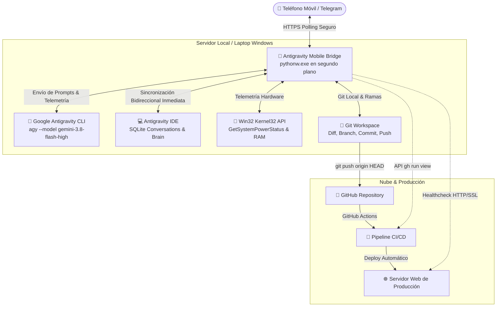

# 🚀 Antigravity Telegram Mobile Bridge

> **Puente móvil autónomo para controlar Google Antigravity CLI e IDE desde Telegram con sincronización bidireccional, telemetría en tiempo real, ejecución guiada por actividad (sin timeouts arbitrarios), automatización Git y vigilancia CI/CD.**

[](https://www.python.org/)
[](https://core.telegram.org/bots/api)
[](https://gemini.google.com/)
[](LICENSE)

---

## 🌟 ¿Qué es Antigravity Mobile Bridge?

**Antigravity Telegram Mobile Bridge** es una pasarela de ingeniería diseñada para desarrolladores que desean operar sus entornos de programación y agentes de IA (**Google Antigravity**) desde su teléfono móvil vía **Telegram**, sin necesidad de abrir la laptop, sin usar escritorios remotos lentos (AnyDesk/RustDesk) y sin exponer puertos SSH a Internet.

El puente se comunica localmente con el motor nativo de **Antigravity CLI (`agy`)**, permitiéndote dar órdenes de código en lenguaje natural, navegar proyectos, cambiar de ramas, revisar diffs sintácticos, aprobar planes de implementación y commitear cambios con mensajes redactados por IA. 

Lo más extraordinario: **Todo lo que haces desde Telegram se sincroniza en tiempo real con el Antigravity IDE de tu computadora.** Al llegar a casa u oficina y abrir tu IDE, el historial completo, los archivos modificados y el contexto de razonamiento están exactamente donde los dejaste.

---

## 📱 Diagrama de Arquitectura



---

## ✨ Características Principales

### 1. 🧠 Integración Completa con Google Antigravity (`agy` & IDE)
- **Sincronización Bidireccional Total (CLI 🔄 IDE):** Cada orden ejecutada desde Telegram actualiza la base de datos SQLite oficial (`conversation_summaries.db`) y el cerebro del agente (`transcript.jsonl`). Los chats iniciados en el IDE se pueden continuar en Telegram y viceversa.
- **Soporte Multimodelo:** Alterna dinámicamente con un botón táctil entre `gemini-3.8-flash-high`, `gemini-3.8-flash-medium`, `gemini-3.7-flash-high`, `claude-sonnet-4-6`, `claude-opus-4-6-thinking`, etc.
- **Telemetría Paso a Paso en Vivo:** Telegram muestra en tiempo real qué herramienta ejecuta el agente (*"💻 Terminal: git status"*, *"📝 Editando: AppService.java"*, *"🔍 Inspeccionando código..."*).
- **Gestión de Brain & Planes:** Detecta automáticamente `implementation_plan.md` y `walkthrough.md`. Puedes revisar el resumen estructurado en tu teléfono y pulsar **[ ▶️ Ejecutar Plan ]** con un solo toque.

### 2. ⏱️ Motor Autónomo Guiado por Actividad (Zero Timeouts)
- **Sin Cortes Forzados de Tiempo:** Se eliminaron los límites arbitrarios tradicionales (como el timeout fijo de 300s). El agente puede trabajar de forma autónoma durante 10, 20 o más de 30 minutos si la tarea lo requiere (ej. refactorizaciones de más de 120 pasos).
- **Idle Watchdog Dinámico (`STEP_IDLE_TIMEOUT`):** El temporizador de inactividad se reinicia continuamente a cero con cada cambio de paso, lectura de archivo o escritura en el log. Solo se detiene si la IA permanece en silencio absoluto sin ningún avance durante 180 segundos.
- **Supresión de Consolas en Windows (`CREATE_NO_WINDOW`):** Todo se ejecuta en segundo plano invisible. Ni `agy` ni sus servidores MCP (`chrome-devtools-mcp`, `antigravity-mem`) abren consolas emergentes en tu pantalla.
- **Limpieza en Árbol (`Tree-Kill`):** En caso de cancelación, se eliminan los procesos en cascada vía `taskkill /F /T` para garantizar cero procesos huérfanos.

### 3. ⚡ Turbo AutoPush Mode (`/autopush`)
- **Flujo 100% Manos Libres:** Cuando está activado, en cuanto la IA termina una tarea y detecta cambios de código, redacta automáticamente el mensaje convencional formal con IA, ejecuta `git add`, `git commit` y `git push origin HEAD`.
- **Blindaje Anti-Errores:** Si la generación del mensaje por IA tarda o falla, cuenta con un *fallback* inteligente y limpio que utiliza tu propio prompt original, evitando que mensajes de error se guarden en el historial de Git.

### 4. 🚀 Vigilancia en Vivo de Despliegues CI/CD (`/ci`)
- Consulta en tiempo real el pipeline de **GitHub Actions** (`in_progress`, `success`, `failure`).
- **Watcher en Segundo Plano:** Pulsa `[ 👁️ Vigilar Fin de Deploy ]` y el bot te enviará una notificación con sonido a Telegram en el momento exacto en que tu web esté desplegada en producción.
- Si la compilación falla, extrae automáticamente el fragmento de log (`--log-failed`) para depuración inmediata desde el móvil.

### 5. 🔋 Watchdog Proactivo de Energía y Batería (`/battery`)
- Conectado a la API nativa `GetSystemPowerStatus` de Windows con 0% de sobrecarga en CPU/RAM.
- **Alerta Proactiva de Corte Eléctrico:** Si se corta la luz en tu casa/oficina o se desconecta el cargador, el bot te avisa en Telegram de inmediato con el porcentaje y autonomía restante.
- **Alerta de Energía Restaurada:** Te confirma cuando la electricidad regresa y la laptop vuelve a estar conectada a la red eléctrica.

### 6. 🌿 Gestor de Ramas Git Móvil (`/branches`)
- Visualiza las ramas recientes con tiempo relativo amigable (*hace 10m*, *hace 2 días*).
- Botones táctiles interactivos `[ 🔀 Cambiar a <Rama> ]` para alternar entre ramas al vuelo.
- Creación rápida de ramas con `/branch <nombre>` (`git checkout -b`).

### 7. 📸 Diagnóstico Multimodal por Imagen
- Envía capturas de pantalla de bugs, interfaces desalineadas o fotos a Telegram.
- El bot las descarga en alta resolución y las analiza con la visión multimodal de Antigravity.

---

## 🛠️ Requisitos Previos

1. **Sistema Operativo:** Windows 10/11 (o Linux/macOS adaptando rutas).
2. **Python:** Versión 3.10 o superior.
3. **Google Antigravity:** CLI instalado y autenticado (`agy --help`).
4. **Git:** Instalado y configurado en el sistema.
5. **GitHub CLI (Opcional, para módulo CI/CD):** `gh` instalado y autenticado (`gh auth login`).
6. **Telegram Bot Token:** Creado a través de [@BotFather](https://t.me/BotFather).
7. **Tu ID de Telegram:** Tu identificador numérico de usuario (obtenlo vía [@userinfobot](https://t.me/userinfobot)).

---

## 🚀 Instalación Rápida

### 1. Clonar el Repositorio
```bash
git clone https://github.com/gersonja/antigravity-telegram-bridge.git
cd antigravity-telegram-bridge
```

### 2. Instalar Dependencias de Python
```bash
pip install python-telegram-bot
```

### 3. Configurar Variables de Entorno (`.env`)
Copia la plantilla `.env.example` a un archivo `.env`:

```bash
copy .env.example .env
```

Edita `.env` con tus datos:

```dotenv
# Token oficial de BotFather
ANTIGRAVITY_BOT_TOKEN=123456789:ABCdefGhIJKlmNoPQRsTUVwxyZ

# Tu ID numérico de Telegram (Whitelist estricto de seguridad)
ANTIGRAVITY_USER_ID=123456789

# Rutas de tus repositorios de desarrollo
ANTIGRAVITY_WORKSPACE_ROOTS=C:\proyectos2026,D:\workspace
ANTIGRAVITY_DEFAULT_PROJECT=C:\proyectos2026\mi-proyecto

# Configuración de IA y modelo
ANTIGRAVITY_DEFAULT_MODEL=gemini-3.8-flash-high

# Timeouts guiados por actividad
ANTIGRAVITY_STEP_IDLE_TIMEOUT=180
ANTIGRAVITY_MAX_TASK_TIMEOUT=0

# Switches de automatización y telemetría
ANTIGRAVITY_DEFAULT_AUTOPUSH=false
ANTIGRAVITY_WATCHDOG_ENABLED=true
ANTIGRAVITY_DEFAULT_HEALTH_URL=https://ejemplo.com
```

### 4. Probar en Consola
```bash
python antigravity_bridge.py
```
Abre Telegram, busca tu bot y envía `/start` o `/status`.

---

## 🔄 Instalación como Servicio en Segundo Plano (Windows)

Para que el bot arranque automáticamente al encender la laptop o iniciar sesión en Windows de forma 100% invisible (sin ventanas negras de consola y sin requerir permisos de Administrador):

Ejecuta con PowerShell:

```powershell
pwsh -File install_bot_service.ps1
```

- Se ejecuta mediante `pythonw.exe` consumiendo menos de **45 MB de memoria RAM**.
- Queda registrado en el inicio automático del usuario (`HKCU:\Software\Microsoft\Windows\CurrentVersion\Run`).
- Para detenerlo y desinstalarlo del inicio automático:
  ```powershell
  pwsh -File uninstall_bot_service.ps1
  ```

---

## 📖 Catálogo de Comandos

| Comando | Descripción | Teclado Interactivo / Botones |
|---|---|---|
| `/start` | Inicialización y comprobación de whitelist. | Botones de acceso directo. |
| `/?` o `/help` | Guía de ayuda contextual según el estado activo. | Menú categorizado. |
| `/status` | **Dashboard principal:** RAM, batería/AC, AutoPush, proyecto, sesión y Git. | Todos los atajos rápidos. |
| `/projects` | Lista y alterna entre los repositorios Git del equipo. | `[ Abrir <Proyecto> ]` |
| `/exit_project` | Desvincula el proyecto actual para volver al selector. | Lista de proyectos. |
| `/sessions` | Lista las conversaciones guardadas del proyecto activo. | `[ 📌 <Título> ]` + `[ ➕ Hilo Limpio ]` |
| `/session <id>` | Salto directo a una sesión por su identificador UUID. | Ficha de sesión. |
| `/exit_session` | Sale de la sesión activa y activa el *Modo Hilo Limpio*. | `[ 💬 Entrar a Sesión ]` |
| `/plan` | Muestra el resumen del plan de implementación (`implementation_plan.md`). | `[ ▶️ Ejecutar Plan ]` |
| `/walkthrough` | Muestra el informe de tareas y cambios implementados (`walkthrough.md`). | Documento descargable. |
| `/diff` | Muestra el diff de cambios no commiteados con color sintáctico. | `[ ✅ Commit ]`, `[ 🗑️ Revertir ]` |
| `/commit [msg]` | Realiza commit y push. Si omites el mensaje, la IA lo genera. | Botón vigilar CI/CD. |
| `/autopush` | Alterna modo Turbo AutoPush (commit & push automático tras cambios). | `[ ⚡ AutoPush: ON/OFF ]` |
| `/ci` o `/cicd` | Estado en tiempo real del pipeline de GitHub Actions. | `[ 👁️ Vigilar Fin de Deploy ]` |
| `/health [url]` | Mide disponibilidad HTTP (200 OK), latencia (ms) y SSL en vivo. | `[ 🔄 Probar de nuevo ]` |
| `/battery` | Nivel de batería, fuente (AC/Batería) y estimación de autonomía. | `[ 🔄 Refrescar ]` |
| `/branches` | Muestra las ramas locales recientes ordenadas por actividad. | `[ 🔀 Cambiar a <Rama> ]` |
| `/branch <nom>` | Cambia a la rama indicada o crea una nueva si no existe. | Confirmación de rama. |
| `/revert` | Descarta modificaciones locales (`git restore . && git clean -fd`). | Confirmación de seguridad. |
| `/models` | Selector de modelo de IA (Gemini 3.8 Flash, Claude Sonnet, etc.). | Botones de modelos. |
| `/cmd <cmd>` | Terminal remota para ejecutar cualquier orden (`npm test`, `dir`). | Salida de consola. |
| 📸 *(Foto)* | Envía una captura de pantalla con texto para análisis visual. | Respuesta multimodal. |

---

## ⚙️ Opciones de Configuración (`.env`)

| Variable | Descripción | Valor por Defecto |
|---|---|---|
| `ANTIGRAVITY_BOT_TOKEN` | Token otorgado por @BotFather. | *(Obligatorio)* |
| `ANTIGRAVITY_USER_ID` | ID de Telegram del usuario autorizado (Whitelist). | *(Obligatorio)* |
| `ANTIGRAVITY_WORKSPACE_ROOTS` | Rutas raíz para escanear repositorios (separadas por coma). | `C:\MisProyectos` |
| `ANTIGRAVITY_DEFAULT_PROJECT` | Repositorio seleccionado por defecto al arrancar. | `C:\MisProyectos\MiApp` |
| `ANTIGRAVITY_DEFAULT_MODEL` | Modelo de IA predeterminado para el CLI. | `gemini-3.8-flash-high` |
| `ANTIGRAVITY_STEP_IDLE_TIMEOUT` | Segundos máximos de inactividad tolerados entre pasos de IA. | `180` |
| `ANTIGRAVITY_MAX_TASK_TIMEOUT` | Techo máximo global en segundos (`0` = deshabilitado). | `0` |
| `ANTIGRAVITY_DEFAULT_AUTOPUSH` | Estado inicial del modo Turbo AutoPush (`true`/`false`). | `false` |
| `ANTIGRAVITY_WATCHDOG_ENABLED` | Activar/desactivar monitor de batería y cortes de luz. | `true` |
| `ANTIGRAVITY_WATCHDOG_INTERVAL` | Segundos entre chequeos del estado de energía. | `45` |
| `ANTIGRAVITY_DEFAULT_HEALTH_URL` | URL de prueba predeterminada para el comando `/health`. | `https://ejemplo.com` |
| `ANTIGRAVITY_STATE_FILE` | Ruta del archivo JSON para persistencia de estado. | `bot_state.json` |

---

## 🔒 Seguridad y Privacidad

- **Whitelist Estricto:** Toda petición proveniente de un ID de Telegram diferente a `ANTIGRAVITY_USER_ID` es descartada silenciosamente.
- **Sin Puertos Expuestos:** Opera mediante el protocolo Long-Polling seguro de Telegram (`getUpdates`), por lo que no requiere abrir puertos en el router ni configurar IP pública fija.
- **Cero Credenciales en Código:** Todos los tokens y rutas sensibles se leen exclusivamente desde `.env` o variables de entorno locales protegidas por `.gitignore`.

---

## 👨‍💻 Autor

**Gerson Javier Castellanos Niño**

- 🐙 **GitHub:** [@gersonja](https://github.com/gersonja)
- 💼 **LinkedIn:** [gersonjavier](https://www.linkedin.com/in/gersonjavier/)

---

## 📄 Licencia

Este proyecto está protegido bajo la **Licencia MIT**. Consulta el archivo [LICENSE](LICENSE) para más detalles.

Copyright (c) 2026 Gerson Javier Castellanos Niño.
